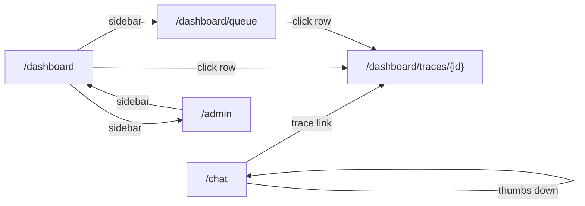

<objective>
Author the chat-request sequence diagram (`docs/sequence-diagrams.md`) AND the 5 UI wireframes + index (`docs/wireframes/*.md`). The sequence diagram is the canonical answer to fresh-agent docs check Q2 ("how does data flow"); the wireframes are the canonical answer to Q5 ("what does the UI look like"). Both consume the API contract authored in Plan 06 (Wave 2) for endpoint names and field shapes.

Purpose: Resolve DSGN-03 and DSGN-07 in a single plan. The sequence diagram encodes Pitfall #1 (OTel context snapshot must be captured BEFORE `root.end()`, otherwise `rag.eval` orphans into a new root) as a design-time `Note over` callout — meaning Phase 4 TRCR-04's executor inherits the mitigation as a contract, not a runtime discovery. The wireframes encode the Tremor v3 + shadcn/ui component inventory so Phase 3/4/5 frontend tasks can copy components verbatim.

Output: 7 markdown files. One sequence-diagram file (~100-140 LOC), 5 wireframe files (~80-140 LOC each), one index README (~40-60 LOC).
</objective>

<execution_context>
@C:/Users/om.mengshetti/Desktop/tracer-ai/.claude/get-shit-done/workflows/execute-plan.md
@C:/Users/om.mengshetti/Desktop/tracer-ai/.claude/get-shit-done/templates/summary.md
</execution_context>

<context>
@.planning/STATE.md
@.planning/REQUIREMENTS.md
@.planning/phases/01-research-design-artifacts/01-CONTEXT.md
@.planning/phases/01-research-design-artifacts/01-RESEARCH.md
@docs/architecture.md
@docs/api.md
@docs/trace-schema.md

<wave_3_dependency_note>
This plan runs in Wave 3 — Wave 2 must have created `docs/architecture.md`, `docs/api.md`, and `docs/trace-schema.md`. The sequence diagram cites architecture for actor naming and api.md for endpoint paths; the wireframes bind regions to api.md endpoints by exact path string. **Do not invent endpoint paths or schemas — copy verbatim from `docs/api.md`.** If an endpoint name differs between this plan's text and `docs/api.md`, that's a bug to fix in this plan.
</wave_3_dependency_note>

<mermaid_renderer_warning>
GitHub's Mermaid renderer is the canonical target. Per RESEARCH.md Artifact 4 syntax tips:
- Avoid `autonumber` (renders oddly on async messages in some GitHub themes).
- Do NOT mix `participant` and `actor` declarations in the same diagram — use `participant` uniformly.
- Tables in markdown cells cannot contain newlines (Pitfall D from RESEARCH.md).
- Wireframe ASCII art goes in fenced code blocks with `text` language hint or no hint (Pitfall C — non-monospace renderers misalign Unicode box chars unless the block is explicitly monospace).
</mermaid_renderer_warning>
</context>

<tasks>

<task type="auto">
  <name>Task 1: Author docs/sequence-diagrams.md (DSGN-03, sync request + async eval branch with OTel context-snapshot callout)</name>
  <files>docs/sequence-diagrams.md</files>
  <read_first>
    - .planning/phases/01-research-design-artifacts/01-CONTEXT.md (D-16, D-48 — sequence diagram MUST encode the snapshot-before-root.end() rule)
    - .planning/phases/01-research-design-artifacts/01-RESEARCH.md §"Per-Artifact Authoring Guide › Artifact 4" (lines 225-241; sequence-diagram structure, the 8 participants, the alt block for eval-failure suppression, and the GitHub renderer gotchas)
    - .planning/research/ARCHITECTURE.md §"System Overview" + §"Anti-Patterns" (Pitfalls #1 / #3 / #4 — the snapshot rule, eval failure must NOT raise to user, dated-snapshot judge model)
    - docs/api.md (Wave 2 sibling — endpoint paths must match: `POST /chat`, `POST /feedback`)
    - docs/architecture.md (Wave 2 sibling — actor naming consistency: `FastAPI`, `Pipeline`, `Tracer`, `Anthropic`, `Postgres`)
    - docs/trace-schema.md (Wave 2 sibling — confirms `rag.eval` is async child of `rag.request` per Pitfall #1)
  </read_first>
  <action>
Create `docs/sequence-diagrams.md` with this exact structure. Length target ~100-140 LOC.

**1. `# Sequence Diagrams` (h1).**

**2. Framing paragraph (1 paragraph)**: "This document shows the runtime data flow for a single `POST /chat` request — both the synchronous request path that returns the answer to the browser, AND the asynchronous evaluation branch dispatched via FastAPI `BackgroundTasks` after response flush. The two phases are visually separated by `Note over` blocks. **Critical design contract** (Pitfall #1): the OTel context snapshot must be captured **before** `root.end()`, otherwise the `rag.eval` span orphans as a new trace root rather than attaching as a child of `rag.request`. This is encoded as a `Note over FastAPI,Tracer` callout in the diagram and **must be honored** by Phase 4 TRCR-04 wiring."

**3. `## POST /chat — sync request path + async eval branch` (h2).**

**4. The Mermaid block** (exactly ONE ```mermaid sequenceDiagram block in this file). Use this skeleton — fill in the messages exactly as specified:

````
```mermaid
sequenceDiagram
  participant Browser
  participant FastAPI
  participant Pipeline
  participant Tracer
  participant Anthropic
  participant BackgroundTasks
  participant Judge
  participant Postgres

  Note over Browser,Postgres: Phase 1 — sync request path

  Browser->>FastAPI: POST /chat {query}
  FastAPI->>Tracer: start_span("rag.request") -> root
  FastAPI->>Pipeline: run(query, root_ctx)

  Pipeline->>Tracer: start_span("rag.retrieve")
  Pipeline->>Postgres: vector_search(query_embedding, top_k=5)
  Postgres-->>Pipeline: chunks[5]
  Pipeline->>Tracer: end_span("rag.retrieve") + write attrs

  Pipeline->>Tracer: start_span("rag.prompt_assemble")
  Pipeline->>Pipeline: assemble_prompt(chunks, query)
  Pipeline->>Tracer: end_span("rag.prompt_assemble") + payload

  Pipeline->>Tracer: start_span("rag.llm_call")
  activate Anthropic
  Pipeline->>Anthropic: messages.create(model="claude-sonnet-4-5-20250929", prompt)
  Anthropic-->>Pipeline: answer + usage
  deactivate Anthropic
  Pipeline->>Tracer: end_span("rag.llm_call") + payload

  Pipeline-->>FastAPI: ChatResponse{answer, cited_chunks, trace_id, ...}

  Note over FastAPI,Tracer: Snapshot otel_context.get_current() BEFORE root.end() — omitting this orphans the rag.eval span (Pitfall #1, D-48)

  FastAPI->>Tracer: ctx_snapshot = capture_context()
  FastAPI->>Tracer: end_span("rag.request") -> root.end()
  FastAPI-->>Browser: 200 ChatResponse

  Note over FastAPI,BackgroundTasks: Phase 2 — async eval branch (fire-and-forget; never raises to user)

  FastAPI-)BackgroundTasks: add_task(run_eval, trace_id, answer, chunks, ctx_snapshot)

  Note over BackgroundTasks,Judge: Phase 3 — judge runs as child of rag.request via ctx_snapshot

  BackgroundTasks->>Tracer: attach_context(ctx_snapshot)
  BackgroundTasks->>Tracer: start_span("rag.eval", parent=root)
  BackgroundTasks->>Judge: score(answer, chunks)
  activate Judge
  Judge->>Anthropic: messages.create(model="claude-haiku-4-5-20251001", judge_prompt)
  Anthropic-->>Judge: faithfulness, relevance
  deactivate Judge
  Judge-->>BackgroundTasks: scores

  alt eval succeeds
    BackgroundTasks->>Postgres: write_span(rag.eval, scores, judge_payload)
    BackgroundTasks->>Tracer: end_span("rag.eval")
  else eval fails (timeout/exception)
    BackgroundTasks->>Tracer: log_error + end_span("rag.eval", status=error)
    Note over BackgroundTasks,Tracer: NEVER re-raise — Pitfall #3 (eval failures must not fail user requests)
  end
```
````

**5. `## Design Contracts Encoded` (h2)** — bullet list confirming what Phase 4 must honor:
- `ctx_snapshot = capture_context()` runs **before** `root.end()` — D-48 / Pitfall #1.
- `BackgroundTasks.add_task(...)` is fire-and-forget; the eval branch is wrapped in a try/except that logs but never re-raises — Pitfall #3.
- `rag.llm_call` uses dated snapshot `claude-sonnet-4-5-20250929`; `rag.eval` uses dated snapshot `claude-haiku-4-5-20251001` — D-50 / Pitfall #4.
- `rag.eval` is a **child** of `rag.request` (via `attach_context(ctx_snapshot)`), not a new root.

**6. `## Cross-References` (final section)**: relative links to `[Architecture](./architecture.md)`, `[API Contract](./api.md)`, `[Trace Schema](./trace-schema.md)`, `[ADR 005 — Observability Strategy](./decisions/005-observability-strategy.md)`.

**Hard rules:**
- Exactly ONE ```mermaid sequenceDiagram fenced block in the file.
- The Note callout text must contain BOTH the literal substring `BEFORE root.end()` AND the literal substring `otel_context.get_current()` (or `ctx_snapshot = capture_context()` — at least one of the two snapshot phrasings) so the verify grep matches.
- Use `participant` declarations only (no `actor`) — RESEARCH.md gotcha.
- Do NOT include `autonumber`.
- The `alt`/`else` block for eval-failure suppression is required.
  </action>
  <verify>
    <automated>test -f docs/sequence-diagrams.md && grep -q '^# Sequence Diagrams' docs/sequence-diagrams.md && grep -c '^```mermaid$' docs/sequence-diagrams.md | grep -q '^1$' && grep -q 'sequenceDiagram' docs/sequence-diagrams.md && for p in 'participant Browser' 'participant FastAPI' 'participant Pipeline' 'participant Tracer' 'participant Anthropic' 'participant BackgroundTasks' 'participant Judge' 'participant Postgres'; do grep -qF "$p" docs/sequence-diagrams.md || { echo "MISSING PARTICIPANT: $p"; exit 1; }; done && grep -qE 'Note (over|right of|left of).*(snapshot|capture_context|otel_context\.get_current)' docs/sequence-diagrams.md && grep -qF 'BEFORE root.end()' docs/sequence-diagrams.md && grep -qF 'POST /chat' docs/sequence-diagrams.md && grep -qF 'BackgroundTasks' docs/sequence-diagrams.md && grep -qE '\)-?\)|FastAPI-\)BackgroundTasks' docs/sequence-diagrams.md && grep -qE '^\s*alt eval succeeds' docs/sequence-diagrams.md && grep -qF 'Pitfall #1' docs/sequence-diagrams.md && ! grep -q '^\s*autonumber' docs/sequence-diagrams.md && ! grep -qE '^\s*actor ' docs/sequence-diagrams.md && grep -qF 'claude-sonnet-4-5-20250929' docs/sequence-diagrams.md && grep -qF 'claude-haiku-4-5-20251001' docs/sequence-diagrams.md && grep -qF 'sequence-diagrams' docs/sequence-diagrams.md || true</automated>
  </verify>
  <acceptance_criteria>
    - File exists at exact path
    - Contains `# Sequence Diagrams` h1
    - Contains exactly one ```mermaid fenced block (count of `^```mermaid$` lines == 1)
    - Block declares `sequenceDiagram`
    - All 8 participants present: Browser, FastAPI, Pipeline, Tracer, Anthropic, BackgroundTasks, Judge, Postgres
    - At least one `Note over|right of|left of` line referencing one of: snapshot, capture_context, otel_context.get_current
    - The literal substring `BEFORE root.end()` appears (D-48 / Pitfall #1 encoded verbatim)
    - References `Pitfall #1` by name in either Note text or design-contracts section
    - The async dispatch arrow `-)` is used (FastAPI-)BackgroundTasks pattern)
    - The `alt eval succeeds` block is present (eval-failure suppression branch)
    - References `POST /chat` (binds to api.md endpoint name)
    - Dated model snapshots present: `claude-sonnet-4-5-20250929` AND `claude-haiku-4-5-20251001` (D-50)
    - No `autonumber` directive (GitHub renderer gotcha)
    - No `actor` declarations (uniform `participant` per RESEARCH.md)
  </acceptance_criteria>
  <done>docs/sequence-diagrams.md committed with one Mermaid sequenceDiagram, 8 participants, the `Note over` snapshot-before-root.end() callout encoding Pitfall #1, the alt/else eval-failure suppression block, and the design-contracts cross-reference list.</done>
</task>

<task type="auto">
  <name>Task 2: Author 5 wireframes + index (DSGN-07, full UI route coverage with state tables)</name>
  <files>docs/wireframes/chat.md, docs/wireframes/dashboard-list.md, docs/wireframes/dashboard-detail.md, docs/wireframes/bad-answer-queue.md, docs/wireframes/admin.md, docs/wireframes/README.md</files>
  <read_first>
    - .planning/phases/01-research-design-artifacts/01-CONTEXT.md (D-27, D-28, D-29, D-30 — wireframe format contract)
    - .planning/phases/01-research-design-artifacts/01-RESEARCH.md §"Per-Artifact Authoring Guide › Artifacts 9–13" (lines 376-402; wireframe structure, route table, ASCII gotchas, component-state coverage rule) AND §"Artifact 14" (lines 404-409; index + Mermaid click-through map)
    - docs/api.md (Wave 2 sibling — endpoint paths and field names that wireframes bind to)
    - docs/trace-schema.md (Wave 2 sibling — only needed by `dashboard-detail.md` for span names in the waterfall layout)
    - .planning/research/STACK.md (Tremor v3 + shadcn/ui component names — Card, Table, Tabs, Dialog, Toast, Badge, Button, Input, Textarea, Tooltip, AreaChart, LineChart, BarChart, KpiCard)
  </read_first>
  <action>
Create 6 wireframe files under `docs/wireframes/` (mkdir the directory if not present). Each wireframe follows the per-wireframe structure from RESEARCH.md Artifact 9-13:

**Per-wireframe structure (D-28 — every wireframe MUST include all 7 sections in this order):**
1. `# Wireframe: <Route Name>` (h1)
2. `## Route` — exact path string
3. `## Bound API Endpoints` — bullet list of endpoints from `docs/api.md` (use exact paths: `POST /chat`, `GET /traces?...`, etc.)
4. `## Component Inventory` — markdown table: `| Region | Component | Library |` rows. Library is `shadcn/ui` or `Tremor v3` or `custom`.
5. `## Layout` — fenced code block with language hint `text` containing the ASCII layout (use Unicode box chars `┌─┐│└┘├┤┬┴┼` — RESEARCH.md says they render fine in monospace markdown viewers; keep ≤80 cols).
6. `## States` — markdown table: `| State | What shows |` with rows for `Loading`, `Empty`, `Error`, `Populated` (all 4 mandatory per RESEARCH.md component-state coverage rule).
7. `## Interactions` — bulleted list mapping user actions to API calls / route changes.

**Wireframe-specific content:**

---

**File 1: `docs/wireframes/chat.md`** (~100 LOC)

- Route: `/chat`
- Bound endpoints: `POST /chat`, `POST /feedback`
- Component inventory rows (at minimum):
  | Region | Component | Library |
  |--------|-----------|---------|
  | Page shell | `Card` | shadcn/ui |
  | Message list | `ScrollArea` | shadcn/ui |
  | User bubble | `Card` (variant=primary) | shadcn/ui |
  | Assistant bubble | `Card` + `Badge`(latency_ms) + `Badge`(input_tokens/output_tokens) + `Badge`(estimated_cost_usd) | shadcn/ui |
  | Citation | `Tooltip` over chunk excerpt | shadcn/ui |
  | Trace link | `Button` (variant=ghost) -> `/dashboard/traces/{trace_id}` | shadcn/ui |
  | Thumbs up/down | `Button` x2 | shadcn/ui |
  | Thumbs-down comment | `Dialog` containing `Textarea` + Submit `Button` | shadcn/ui |
  | Diagnosis tag (Phase 5 FBCK-05) | `Select` inside the Dialog | shadcn/ui |
  | Input bar | `Textarea` (autosize) + Send `Button` | shadcn/ui |
- ASCII layout: a vertical stack — top: app header with `tracer-ai` title; middle: scrollable message list (show 1 user bubble + 1 assistant bubble with latency/tokens/cost badges and a `[trace ↗]` link, plus a `[👍] [👎]` row); bottom: input bar with `Textarea` and `[Send]`. Sample query in the user bubble: `"How do I use prompt caching with Claude?"` (self-referential, per CONTEXT.md `<specifics>`).
- States table: `Loading` = skeleton bubble + disabled input; `Empty` = "Ask a question to start. Example: How do I authenticate to the Anthropic Messages API?"; `Error` = inline `Alert` with retry button; `Populated` = stack of bubbles with latest at the bottom.
- Interactions: clicking `Send` calls `POST /chat`; clicking `[trace ↗]` navigates to `/dashboard/traces/{trace_id}`; clicking `👎` opens the `Dialog` and calls `POST /feedback` on Submit (rating=-1, optional comment, optional diagnosis_tag); clicking `👍` calls `POST /feedback` immediately (rating=1, no dialog).

---

**File 2: `docs/wireframes/dashboard-list.md`** (~90 LOC)

- Route: `/dashboard`
- Bound endpoints: `GET /traces` (with query params: `query`, `since`, `until`, `feedback`, `min_faithfulness`, `max_latency_ms`, `limit`, `cursor`)
- Component inventory rows (at minimum):
  | Region | Component | Library |
  |--------|-----------|---------|
  | Page header | `Card` | shadcn/ui |
  | KPI strip (count, avg latency, avg faithfulness, total cost) | `KpiCard` x4 | Tremor v3 |
  | Quality drift mini-chart | `AreaChart` (categories=[`faithfulness`, `relevance`]) | Tremor v3 |
  | Filter bar | `Input` (search query), `Select` (time window), `Select` (feedback up/down/all), `Slider` (min_faithfulness) | shadcn/ui |
  | Trace list | `Table` | shadcn/ui |
  | Row: rating | `Badge` (variant=positive/negative) | shadcn/ui |
  | Row: faithfulness | `Tooltip` over numeric value | shadcn/ui |
  | Pagination | `Button` (Load more — uses `next_cursor`) | shadcn/ui |
- ASCII layout: top header band; KPI strip (4 cards in a row); area chart spanning full width below KPIs; filter bar; table with columns `started_at | query | latency_ms | cost_usd | faithfulness | rating`; "Load more" button at the bottom.
- States: `Loading` = `Table` skeleton rows + KPI shimmer; `Empty` = "No traces match these filters" + reset-filters button; `Error` = inline `Alert`; `Populated` = filled table + KPIs + chart.
- Interactions: clicking a row navigates to `/dashboard/traces/{trace_id}`; changing a filter re-fetches `GET /traces`; "Load more" appends rows using `cursor`.

---

**File 3: `docs/wireframes/dashboard-detail.md`** (~120 LOC)

- Route: `/dashboard/traces/{trace_id}`
- Bound endpoints: `GET /traces/{trace_id}`
- Component inventory rows (at minimum):
  | Region | Component | Library |
  |--------|-----------|---------|
  | Header card (query text, latency, cost, faithfulness, relevance) | `Card` + `Badge` x4 | shadcn/ui |
  | Tab bar | `Tabs` (tabs: Spans, Payloads, Feedback) | shadcn/ui |
  | Span waterfall | custom waterfall using nested `<details>` or a thin `Tree` component | custom |
  | Span row labels | one of: `rag.request`, `rag.retrieve`, `rag.prompt_assemble`, `rag.llm_call`, `rag.eval` | (string literals from trace-schema) |
  | Span attrs JSON | `<pre>` block | custom |
  | Payload inspector | `Tabs` (per span_id) + `<pre>` block | shadcn/ui |
  | Diagnosis tag (Phase 5 FBCK-05 future) | `Badge` + `Select` (Retrieval / Prompt / Model / Corpus) | shadcn/ui |
  | Back to list | `Button` -> `/dashboard` | shadcn/ui |
- ASCII layout: header card (query + 4 badges); tab bar; tab 1 (Spans) — waterfall showing 5 nested rows with the canonical span names from trace-schema (`rag.request` at top, `rag.retrieve / rag.prompt_assemble / rag.llm_call` indented under it, `rag.eval` indented under root with a dashed line indicating async parentage); tab 2 (Payloads) — span_id selector + JSON viewer; tab 3 (Feedback) — rating + comment + diagnosis_tag.
- States: `Loading` = waterfall skeleton; `Empty` = "Trace not found — it may have been purged"; `Error` = inline `Alert`; `Populated` = full waterfall + payloads + feedback panel. Document an additional `Eval pending` state for the case where `rag.eval` hasn't completed yet (faithfulness/relevance fields show `—`).
- Interactions: clicking a span row expands attrs in-line; switching to Payloads tab loads the JSONB payload from the response; clicking the diagnosis_tag `Select` (Phase 5 future) calls `POST /feedback` with `diagnosis_tag` set; back button returns to `/dashboard` preserving filters via URL params.

---

**File 4: `docs/wireframes/bad-answer-queue.md`** (~85 LOC)

- Route: `/dashboard/queue`
- Bound endpoints: `GET /traces?feedback=down` and `GET /traces?min_faithfulness=0.6` (two pre-filtered list views, surfaced via tab toggle)
- Component inventory rows (at minimum):
  | Region | Component | Library |
  |--------|-----------|---------|
  | Header card (queue title, count badge) | `Card` + `Badge` | shadcn/ui |
  | Source toggle (User-flagged / Judge-flagged) | `Tabs` | shadcn/ui |
  | Queue table | `Table` (sorted by faithfulness ASC for judge-flagged; by created_at DESC for user-flagged) | shadcn/ui |
  | Row: faithfulness | `Badge` (red < 0.6) | shadcn/ui |
  | Row: rating | `Badge` (variant=negative) | shadcn/ui |
  | "Mark Resolved" | `Button` (variant=ghost) | shadcn/ui |
  | "Promote to Regression Set" | `Button` (variant=primary) — wires up in Phase 6 CLI-05 | shadcn/ui |
  | Promote dialog | `Dialog` + `Textarea` (notes) + Submit `Button` | shadcn/ui |
- ASCII layout: header band with count `[42 bad answers]`; tab toggle `[ User-flagged | Judge-flagged ]`; table with columns `started_at | query | faithfulness | rating | actions` where `actions` shows two buttons (`Resolve`, `Promote`).
- States: `Loading` = skeleton; `Empty` = "No bad answers in this queue 🎉"; `Error` = inline `Alert`; `Populated` = sortable table.
- Interactions: clicking a row navigates to `/dashboard/traces/{trace_id}`; clicking `Resolve` calls (Phase 5 endpoint placeholder — note in prose: "endpoint TBD in Phase 5 FBCK-04; this wireframe documents the UI surface only"); clicking `Promote` opens `Dialog` and (Phase 6) calls the regression-set CLI promotion endpoint.

---

**File 5: `docs/wireframes/admin.md`** (~95 LOC)

- Route: `/admin`
- Bound endpoints: `GET /admin/corpus`, `POST /admin/ingest`, `PATCH /admin/chunking-config`
- Component inventory rows (at minimum):
  | Region | Component | Library |
  |--------|-----------|---------|
  | Corpus stats card (chunk_count, embedding_model, embedding_model_version, last_indexed_at) | `Card` + `KpiCard` | Tremor v3 + shadcn/ui |
  | Doc list | `Table` (cols: doc_id, doc_section, chunk_count, last_indexed_at) | shadcn/ui |
  | Re-index button | `Button` (variant=primary) | shadcn/ui |
  | Re-index source picker | `Select` (`claude-docs` | `Custom URLs`) | shadcn/ui |
  | Custom URL list | `Textarea` (newline-delimited URLs) | shadcn/ui |
  | Ingest progress | `Toast` (job_id + status badge) | shadcn/ui |
  | Chunking config form | `Form` with `Input` (chunk_size, type=number, min=100, max=4000) + `Input` (overlap, type=number, min=0, max=500) | shadcn/ui |
  | Save chunking config | `Button` -> `PATCH /admin/chunking-config` | shadcn/ui |
- ASCII layout: top — corpus stats card with 4 KPI tiles; below — doc list table; right rail — `Re-index` form + `Chunking config` form; toasts pinned bottom-right when ingest job is running.
- States: `Loading` = stats card skeleton + table skeleton; `Empty` = "Corpus not yet ingested. Click Re-index to start."; `Error` = inline `Alert` per form (Pydantic 422 errors mapped to field-level `<FormMessage>`); `Populated` = full stats + doc list + filled forms.
- Interactions: clicking `Re-index` calls `POST /admin/ingest` with the selected source; clicking `Save` on the chunking form calls `PATCH /admin/chunking-config`; on success show `Toast` "Config updated — applies on next index"; field validation matches the Pydantic constraints (`chunk_size: 100-4000`, `overlap: 0-500`).

---

**File 6: `docs/wireframes/README.md`** (~50 LOC)

Structure (per RESEARCH.md Artifact 14):

1. `# Wireframes Index` (h1).
2. **Framing paragraph (1 paragraph)**: "ASCII wireframes for the 5 React routes in tracer-ai. Each file documents the route's component inventory (Tremor v3 + shadcn/ui), the layout, the four standard states (Loading / Empty / Error / Populated), and the interactions that bind UI controls to API endpoints in [api.md](../api.md). No image files, no Figma — diff-able markdown only (D-29)."
3. **Wireframe table** with columns `| File | Route | Purpose | Bound endpoints |`. Rows for the 5 wireframes (use exact filenames + route paths from above).
4. `## Click-through Map` (h2) — Mermaid `flowchart LR` block per D-30:

````

````

5. `## Cross-References` (h2) — relative links: `[API Contract](../api.md)`, `[Sequence Diagrams](../sequence-diagrams.md)`, `[Trace Schema](../trace-schema.md)`, `[Architecture](../architecture.md)`.

**Hard rules across all 6 files:**
- Every wireframe file must contain h2 sections `## Route`, `## Bound API Endpoints`, `## Component Inventory`, `## Layout`, `## States`, `## Interactions` (exact strings — verify greps match).
- Every `## States` table must list all 4 of: `Loading`, `Empty`, `Error`, `Populated` (RESEARCH.md component-state coverage rule).
- Every wireframe binds at least one endpoint string from `docs/api.md` (e.g., the literal `POST /chat`, `GET /traces`, etc.).
- The README must contain exactly one ```mermaid flowchart LR block.
- ASCII layouts go in fenced code blocks with `text` language hint or no language hint (Pitfall C — non-monospace renderer guard).
  </action>
  <verify>
    <automated>for f in docs/wireframes/chat.md docs/wireframes/dashboard-list.md docs/wireframes/dashboard-detail.md docs/wireframes/bad-answer-queue.md docs/wireframes/admin.md docs/wireframes/README.md; do test -f "$f" || { echo "MISSING FILE: $f"; exit 1; }; done && for f in docs/wireframes/chat.md docs/wireframes/dashboard-list.md docs/wireframes/dashboard-detail.md docs/wireframes/bad-answer-queue.md docs/wireframes/admin.md; do for h in '## Route' '## Bound API Endpoints' '## Component Inventory' '## Layout' '## States' '## Interactions'; do grep -qF "$h" "$f" || { echo "MISSING SECTION '$h' in $f"; exit 1; }; done; for state in 'Loading' 'Empty' 'Error' 'Populated'; do grep -qF "$state" "$f" || { echo "MISSING STATE '$state' in $f"; exit 1; }; done; done && grep -qF 'POST /chat' docs/wireframes/chat.md && grep -qF 'POST /feedback' docs/wireframes/chat.md && grep -qF 'GET /traces' docs/wireframes/dashboard-list.md && grep -qF 'GET /traces/{trace_id}' docs/wireframes/dashboard-detail.md && grep -qF 'min_faithfulness' docs/wireframes/bad-answer-queue.md && grep -qF 'POST /admin/ingest' docs/wireframes/admin.md && grep -qF 'PATCH /admin/chunking-config' docs/wireframes/admin.md && grep -qF 'GET /admin/corpus' docs/wireframes/admin.md && grep -qF '^# Wireframes Index' docs/wireframes/README.md || grep -q '^# Wireframes Index' docs/wireframes/README.md && grep -c '^```mermaid$' docs/wireframes/README.md | grep -q '^1$' && grep -q 'flowchart LR' docs/wireframes/README.md && grep -qF 'chat.md' docs/wireframes/README.md && grep -qF 'dashboard-list.md' docs/wireframes/README.md && grep -qF 'dashboard-detail.md' docs/wireframes/README.md && grep -qF 'bad-answer-queue.md' docs/wireframes/README.md && grep -qF 'admin.md' docs/wireframes/README.md && grep -qE '(Tremor|tremor)' docs/wireframes/dashboard-list.md && grep -qE '(shadcn|Card|Tabs|Badge)' docs/wireframes/chat.md && grep -qF 'rag.request' docs/wireframes/dashboard-detail.md && grep -qF 'rag.eval' docs/wireframes/dashboard-detail.md</automated>
  </verify>
  <acceptance_criteria>
    - All 6 files exist at exact paths under docs/wireframes/
    - Each of the 5 wireframe files contains all 6 required h2 sections: Route, Bound API Endpoints, Component Inventory, Layout, States, Interactions
    - Each of the 5 wireframe files documents all 4 states by name: Loading, Empty, Error, Populated
    - chat.md binds POST /chat AND POST /feedback
    - dashboard-list.md binds GET /traces
    - dashboard-detail.md binds GET /traces/{trace_id} AND references span names rag.request and rag.eval
    - bad-answer-queue.md references min_faithfulness query parameter
    - admin.md binds all 3 admin endpoints: GET /admin/corpus, POST /admin/ingest, PATCH /admin/chunking-config
    - README.md contains h1 "Wireframes Index", exactly one ```mermaid flowchart LR block (D-30), and links to all 5 wireframe files by filename
    - At least one wireframe references Tremor (KpiCard / AreaChart) and shadcn/ui components by name
  </acceptance_criteria>
  <done>6 wireframe files committed: 5 route wireframes with full state tables + component inventories binding to docs/api.md endpoint paths, plus the index README with Mermaid click-through map per D-30.</done>
</task>

</tasks>

<threat_model>
## Trust Boundaries

| Boundary | Description |
|----------|-------------|
| Author -> markdown file | Sole boundary |
| Phase 1 -> Phase 4 TRCR-04 | The Mermaid `Note over` callout encoding Pitfall #1 IS the design contract |
| Phase 1 -> Phase 3/4/5 frontend tasks | The component-inventory tables ARE the contract — drift = wrong shadcn/Tremor name imported |
| GitHub Mermaid renderer -> human reader | Diagram syntax errors cause silent render failure (no on-page error) |

## STRIDE Threat Register

| Threat ID | Category | Component | Disposition | Mitigation Plan |
|-----------|----------|-----------|-------------|-----------------|
| T-01-07-01 | Tampering | Mermaid syntax error in `sequenceDiagram` block (e.g., stray `autonumber`, mixing `participant`/`actor`) causes silent failure to render in GitHub | mitigate | Verify step asserts: exactly one ```mermaid block, no `autonumber`, no `actor` lines, all 8 `participant` declarations present. Author tested on GitHub Mermaid renderer per RESEARCH.md Artifact 4 gotcha. |
| T-01-07-02 | Tampering | Sequence diagram omits the OTel context-snapshot `Note over` callout — Phase 4 TRCR-04 executor reads the diagram, doesn't see the rule, orphans `rag.eval` (Pitfall #1 manifest) | mitigate | Verify step requires: `Note over` referencing snapshot/capture_context AND the literal `BEFORE root.end()` substring. Design-contracts section duplicates the rule in prose for redundancy. |
| T-01-07-03 | Tampering | Wireframe component inventory drifts from STACK.md — wrong shadcn/Tremor component names cause Phase 3 frontend tasks to import non-existent symbols | mitigate | Component-inventory tables in this plan list components verbatim from RESEARCH.md Artifact 9-13 + STACK.md Frontend Libraries section (`Card`, `Table`, `Tabs`, `Dialog`, `KpiCard`, `AreaChart`, etc.). Verify step greps for `Tremor`/`shadcn` mentions. |
| T-01-07-04 | Tampering | Wireframe binds an endpoint string that does not match `docs/api.md` (e.g., `POST /chats` vs `POST /chat`) — frontend implementer copies the typo | mitigate | Verify step asserts each wireframe contains the exact endpoint paths from api.md (`POST /chat`, `POST /feedback`, `GET /traces`, `GET /traces/{trace_id}`, `POST /admin/ingest`, `GET /admin/corpus`, `PATCH /admin/chunking-config`). |
| T-01-07-05 | Information Disclosure (proxy) | Wireframe missing one of Loading/Empty/Error/Populated state docs — fresh-agent docs check Q5 fails because "what does the UI look like" is incomplete (RESEARCH.md component-state coverage rule) | mitigate | Verify step asserts all 4 state names appear in each of the 5 wireframe files. |
| T-01-07-06 | Tampering | Mermaid click-through map in wireframes/README.md missing one or more routes, leaving the navigation contract incomplete | mitigate | Verify step asserts wireframes/README.md contains exactly one ```mermaid flowchart LR block AND links each of the 5 wireframe filenames in the table. |
</threat_model>

<verification>
- 7 files total: docs/sequence-diagrams.md + 5 wireframes + wireframes/README.md
- Sequence diagram has exactly one Mermaid block, all 8 participants, the snapshot-before-root.end() Note callout, the alt/else eval-failure suppression
- Each wireframe has 6 required h2 sections + 4 named states + endpoint bindings
- README has Mermaid click-through flowchart linking 5 routes
</verification>

<success_criteria>
- DSGN-03 satisfied (sequence diagram with sync + async branches + OTel snapshot callout)
- DSGN-07 satisfied (5 wireframes + index covering all 5 routes)
- Fresh-agent docs check Q2 ("how does data flow") answerable from sequence-diagrams.md alone
- Fresh-agent docs check Q5 ("what does the UI look like") answerable from wireframes/README.md + 5 wireframes alone
- Phase 4 TRCR-04 executor reads sequence-diagrams.md and gets the Pitfall #1 mitigation as a design contract (no runtime discovery)
- Phase 3/4/5 frontend tasks copy component names verbatim from wireframe inventories — no shadcn/Tremor symbol drift
</success_criteria>

<output>
After completion, create `.planning/phases/01-research-design-artifacts/01-07-SUMMARY.md` with: list of 7 file paths, line counts per file, the 8 sequence-diagram participants enumerated, the 5 routes enumerated, confirmation that the OTel context-snapshot Note callout is present in sequence-diagrams.md, and confirmation that each wireframe documents all 4 states (Loading / Empty / Error / Populated).
</output>
