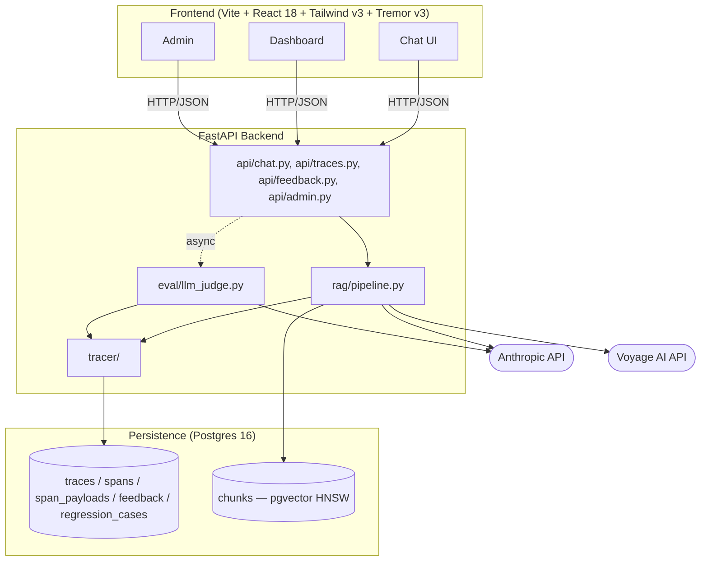

# Phase 1: Research & Design Artifacts - Research

**Researched:** 2026-05-04
**Domain:** Markdown documentation authoring (ADRs, Mermaid diagrams, API/schema specs, ASCII wireframes, YAML coverage set)
**Confidence:** HIGH

<user_constraints>
## User Constraints (from CONTEXT.md)

### Locked Decisions

**ADR Format & Index**
- **D-01:** ADR template = MADR-lite (Nygard-style). Four required sections: `## Status`, `## Context`, `## Options Considered`, `## Decision`, `## Consequences`. Optional `## References`. One page max per ADR. Status starts as `Accepted` since each ADR cites the already-completed research in `.planning/research/`.
- **D-02:** ADR filenames: `/docs/decisions/NNN-<slug>.md` zero-padded 3 digits (`001`–`010`). Slug is hyphen-case noun phrase.
- **D-03:** ADR numbering: `001`–`009` map 1:1 to `GSD-OPEN-1`..`GSD-OPEN-9`. `010` is the scope-trim plan (DSGN-09). An `/docs/decisions/README.md` index lists all ADRs with one-line summaries — fresh agents land here first.
- **D-04:** Every ADR cites the relevant research file (`.planning/research/SUMMARY.md`, `STACK.md`, `ARCHITECTURE.md`, `PITFALLS.md`, `FEATURES.md`) by section anchor. Research is the canonical source — ADRs codify the decision and consequences, not the analysis.

**Decisions Already Locked (codified into ADRs without re-discussion)**
- **D-05:** ADR 001 (charting) → Tremor v3.
- **D-06:** ADR 002 (vector store) → pgvector on the same Postgres 16 instance as the trace DB.
- **D-07:** ADR 003 (embedder) → Voyage AI `voyage-code-3` primary; `sentence-transformers` `nomic-embed-text-v1.5` fallback. Pricing verification is a Phase 2 prereq, not a Phase 1 blocker.
- **D-08:** ADR 004 (trace store) → Postgres 16 + JSONB, GIN-indexed. Single instance with pgvector.
- **D-09:** ADR 005 (observability strategy) → Custom tracer with OTel GenAI **attribute names only** as constants in `tracer/span.py`. Do NOT take a runtime dependency on `opentelemetry-sdk`. Use `gen_ai.provider.name` (NOT deprecated `gen_ai.system`).
- **D-10:** ADR 006 (chunking) → Markdown-header-aware splitter at `##`/`###`; never splits inside fenced code blocks; configurable size + overlap. Default `chunk_size=900 tokens`, `overlap=100 tokens`.
- **D-11:** ADR 007 (re-ranking) → None in v1. Config flag `ENABLE_RERANKER` reserved for v2.
- **D-12:** ADR 008 (judge prompts + thresholds) → RAGAS-style faithfulness + relevance prompts. Untrusted content wrapped in XML delimiters. Initial threshold `faithfulness < 0.6` flags bad-answer; calibrated against ~30 hand-labeled traces in Phase 5.
- **D-13:** ADR 009 (auth + v1.5 deployment) → ADR-only direction; do NOT implement in v1.

**Diagram Tooling**
- **D-14:** All diagrams use Mermaid in fenced code blocks inside markdown files. No PNG/SVG, no Excalidraw, no PlantUML.
- **D-15:** System architecture diagram = Mermaid `flowchart TD` (top-down) with subgraphs for Frontend / FastAPI / Persistence.
- **D-16:** Sequence diagram = Mermaid `sequenceDiagram` showing the sync `POST /chat` request path AND the async `BackgroundTasks`-driven eval branch on the same diagram. Includes the OTel context-snapshot hand-off.
- **D-17:** ERD = Mermaid `erDiagram` with all 5 tables and FKs: `traces`, `spans`, `span_payloads` (1:N off `spans`), `feedback` (N:1 off `traces`), `regression_cases`. pgvector collection schema documented as a separate fenced SQL block alongside the ERD.
- **D-18:** Module dependency diagram = Mermaid `flowchart LR` with one node per module (`config`, `tracer/`, `rag/`, `eval/`, `corpus/`, `api/`, `cli/`, `errors`).

**Trace Schema Spec Format**
- **D-19:** `/docs/trace-schema.md` is one `##` section per span, in this order: `rag.request` (root), `rag.retrieve`, `rag.prompt_assemble`, `rag.llm_call`, `rag.eval`, `feedback.user`.
- **D-20:** Each span section contains: (a) one-line purpose, (b) attribute table with columns `name | type | required | OTel status | example`, (c) JSON example payload, (d) any payload-table reference.
- **D-21:** All `gen_ai.*` and `rag.*` attribute names codified once at the top of `/docs/trace-schema.md` and copy-paste-ready as Python constants — Phase 4 TRCR-01 imports the same names into `tracer/span.py`.
- **D-22:** Document the OTel deprecation note explicitly: `gen_ai.system` is deprecated; use `gen_ai.provider.name`. Naming may change — central constants file is the mitigation.

**API Contract Format**
- **D-23:** `/docs/api.md` is one `##` section per endpoint: `POST /chat`, `POST /feedback`, `GET /traces`, `GET /traces/{id}`, `POST /admin/ingest`, `GET /admin/corpus`, `PATCH /admin/chunking-config`.
- **D-24:** Each endpoint section: HTTP method + path + summary, request schema as Pydantic v2 class, response schema as Pydantic v2 class, example request body JSON, example response body JSON, error responses table.
- **D-25:** Do NOT generate an OpenAPI YAML in Phase 1. FastAPI auto-generates `/openapi.json` from the Pydantic models in Phase 2.
- **D-26:** Pydantic shapes use `model_config = ConfigDict(extra="forbid")` and explicit field types — copy-paste safe into `tracer_ai/api/schemas.py` in Phase 2/3.

**Wireframes Format**
- **D-27:** Wireframes are markdown files under `/docs/wireframes/` with embedded ASCII box layouts + bullet-point annotations. One file per route: `chat.md`, `dashboard-list.md`, `dashboard-detail.md`, `bad-answer-queue.md`, `admin.md`.
- **D-28:** Each wireframe documents: ASCII layout, component inventory (shadcn/ui + Tremor), data sources (which API endpoint binds to each region), empty/loading/error states, interactions.
- **D-29:** No image files, no Figma, no Excalidraw.
- **D-30:** Wireframes index file `/docs/wireframes/README.md` links all five and shows the click-through map.

**Coverage Query Set Format & Authoring**
- **D-31:** File path `/docs/eval/coverage_set.yaml`.
- **D-32:** Schema per query: `id`, `query`, `doc_section`, `expected_chunk_keywords`, `expected_min_score`, `notes`.
- **D-33:** 12 queries covering: `auth`, `models`, `messages`, `tools`, `batches`, `files`, `citations`, `vision`, `errors-and-rate-limits`, `prompt-caching`, `agent-sdk-overview`, `agent-sdk-tools`.
- **D-34:** Hand-curated against a Claude API docs TOC — not LLM-generated.
- **D-35:** No ground-truth answer text. Coverage queries assert *retrieval coverage*, not answer correctness.

**Risk + Scope-Trim Plan (DSGN-09)**
- **D-36:** Codified as ADR `010-scope-trim.md`. Single trigger: build budget slips >25% (projected hours > 15 against ~12-hour target).
- **D-37:** Cut order on trigger: (1) DEMO-02/03/04, (2) DASH-04, (3) FBCK-05 UI, (4) CLI-04 markdown, (5) EVAL-06 calibration size 30→15.
- **D-38:** Cuts are listed but not pre-approved.

**Verification Gate**
- **D-39:** "Fresh-agent docs check" — spawn a sub-agent given ONLY `/docs/` and ask the 5 questions from ROADMAP.md success criteria 2.
- **D-40:** No per-ADR review gate. ADRs go straight to "Accepted".

**Anti-Patterns Baked Into Artifacts**
- **D-47:** Trace schema MUST flag: do NOT store full prompt/response text as span attributes (4–16KB OTel limit) — use `span_payloads` JSONB side table.
- **D-48:** Sequence diagram MUST show OTel context snapshot capture **before** `root.end()`, with a `Note` callout.
- **D-49:** ADR 003 MUST require `embedding_model` + `embedding_model_version` + `indexed_at` columns on the chunk table and a startup assertion that `config.embedding_model == corpus.embedding_model`.
- **D-50:** ADR 008 MUST require pinning Haiku to a dated snapshot (e.g., `claude-haiku-4-5-20251001`), not the alias.
- **D-51:** ADR 004 MUST require partitioning the `spans` table by `started_at` month.

### Claude's Discretion
- Open to user override on D-32 query schema fields, D-37 cut order, and D-10 default chunk size/overlap during planning if a different signal emerges.
- All discuss decisions ran in `--auto` mode; planner may flag any for user re-confirmation if execution surfaces a contradiction.

### Deferred Ideas (OUT OF SCOPE)
- Voyage AI pricing verification — deferred to Phase 2 (a prereq checkbox on INFRA-01).
- Judge calibration set (~30 hand-labeled traces) — deferred to Phase 5 EVAL-06.
- Snapshot of demo corpus to a fixture file — deferred to Phase 7 DEMO-07.
- OpenAPI YAML / JSON schema export — deferred to Phase 2 (FastAPI auto-generates).
- Per-stage failure diagnosis tag UI — deferred to Phase 5 (FBCK-05). Phase 1 only locks its presence in the trace schema and API contract.
- Cross-encoder reranker — deferred to v2 (V2-RANK-01).
- Streaming responses, auth/multi-tenant, multi-modal input, agentic multi-hop — all v2.
</user_constraints>

<phase_requirements>
## Phase Requirements

| ID | Description | Research Support |
|----|-------------|------------------|
| DSGN-01 | All `[GSD-OPEN-N]` items resolved as ADRs in `/docs/decisions/NNN-<slug>.md` (one ADR per item, with context/options/decision/consequences) | MADR-lite template (§"ADR Template"); resolutions from `.planning/research/SUMMARY.md` §"GSD-OPEN-N Resolution Status"; one ADR each for items 1–9 mapped to filenames `001`–`009`. |
| DSGN-02 | System architecture diagram (Mermaid `graph` or `flowchart`) at `/docs/architecture.md` showing frontend/backend/data stores/external APIs | Mermaid `flowchart TD` syntax (§"Mermaid Syntax Reference"); ASCII source-of-truth in `.planning/research/ARCHITECTURE.md` §"System Overview"; subgraph pattern for Frontend/FastAPI/Persistence. |
| DSGN-03 | Chat request sequence diagram (Mermaid `sequenceDiagram`) showing sync request path + async eval branch | Mermaid `sequenceDiagram` syntax (§"Mermaid Syntax Reference"); flow defined in `.planning/research/ARCHITECTURE.md` §"Request Flow"; OTel context-snapshot pattern (Pitfall #1). |
| DSGN-04 | Trace schema spec at `/docs/trace-schema.md` — formal table of every span name, attribute, type, OTel-conformance status, example payload | OTel attribute inventory (§"Per-Artifact Authoring Guide › trace-schema.md"); 6 spans defined in D-19; OTel GenAI conventions cited in `ARCHITECTURE.md` §"OTel GenAI Semantic Conventions — Status as of 2026". |
| DSGN-05 | DB schema / ERD at `/docs/data-model.md` (Mermaid `erDiagram`) for `traces`, `spans`, `feedback`, `regression_cases`, plus vector store collection schema | Mermaid `erDiagram` syntax (§"Mermaid Syntax Reference"); SQL schema sketch in `.planning/research/STACK.md` §"GSD-OPEN-4"; pgvector collection schema as fenced SQL block. |
| DSGN-06 | API contract at `/docs/api.md` with Pydantic shapes for `POST /chat`, `GET /traces`, `GET /traces/{id}`, `POST /feedback`, ingest + admin endpoints | 7 endpoints defined in D-23; Pydantic v2 patterns (§"Per-Artifact Authoring Guide › api.md"); error envelope pattern from `errors.py` ADDITION in `ARCHITECTURE.md`. |
| DSGN-07 | UI wireframes at `/docs/wireframes/` for chat, trace list, trace detail, bad-answer queue, admin | 5 routes from D-27; ASCII layout pattern (§"Per-Artifact Authoring Guide › wireframes"); component inventory drawn from Tremor v3 + shadcn/ui (`STACK.md`); features mapped to PRD §6. |
| DSGN-08 | Module dependency diagram confirming the architecture-research module layout has no circular deps | Mermaid `flowchart LR` (§"Mermaid Syntax Reference"); dependency graph in `ARCHITECTURE.md` §"Dependency Graph (no cycles)"; visual acyclicity check is Phase 1; runtime check is Phase 2 INFRA-04 pre-commit. |
| DSGN-09 | Risk + scope-trim plan (which phases get cut first if budget slips >25%) | Cut order from D-37; codified as ADR 010 per D-36; `FEATURES.md` "P3 / Defer" lists are the cut-source candidates. |
| DSGN-10 | Proactive coverage regression query set (10+ queries) | 12 queries drafted in §"Coverage Query Set Draft"; `.planning/research/PITFALLS.md` Pitfall #10 documents why proactive set is mandatory. |
</phase_requirements>

## Summary

Phase 1 is a documentation-authoring phase: every deliverable is a markdown file (or single YAML) under `/docs/`. The technical decisions are already locked by `.planning/research/` — Phase 1's job is to **codify** those decisions into stable, fresh-agent-readable artifacts that downstream phases consume by reference (`/docs/api.md` for Pydantic shapes, `/docs/trace-schema.md` for OTel attribute constants, `/docs/eval/coverage_set.yaml` for the proactive regression set, etc.). No code, no installs, no `docker compose`.

The research below provides the planner with: (a) a concrete authoring guide for each artifact (structure, syntax tips, copy-paste templates), (b) a Mermaid syntax reference verified against `mermaid.js.org`, (c) an MADR-lite ADR template covering all D-01 sections, (d) a 12-query draft of the coverage set so the executor doesn't re-derive it, (e) the verification sub-agent design (which sub-agent type, the 5 onboarding questions verbatim, pass/fail criteria), and (f) a suggested 3-wave plan decomposition that maximizes parallelism given the artifact dependency graph.

**Primary recommendation:** Decompose Phase 1 into three waves — Wave 1 authors all 10 ADRs + module-deps diagram + coverage set in parallel (no inter-deps); Wave 2 authors trace-schema + ERD + architecture diagram + API contract in parallel (only need ADRs as references); Wave 3 authors sequence diagram + 5 wireframes in parallel (need API contract from Wave 2). Final task: spawn an `Explore` sub-agent restricted to `/docs/` and run the 5-question fresh-agent docs check.

## Architectural Responsibility Map

| Capability | Primary Tier | Secondary Tier | Rationale |
|------------|-------------|----------------|-----------|
| ADR authoring (decision record) | Documentation | — | Pure markdown; no runtime tier involved. ADRs codify decisions for downstream tiers but are themselves prose. |
| Mermaid diagrams (architecture, sequence, ERD, module-deps) | Documentation | — | Rendered by GitHub markdown engine at view time; no build step or runtime tier. |
| Trace schema spec | Documentation | (informs Backend tier in Phase 4) | Declarative spec only in Phase 1; constants are imported into `tracer_ai/tracer/span.py` in Phase 4 TRCR-01. |
| API contract (Pydantic shapes) | Documentation | (informs Backend tier in Phase 2/3) | Shapes are spec-only in Phase 1; copy-pasted into `tracer_ai/api/schemas.py` in Phase 2/3. |
| Wireframes (ASCII + component inventory) | Documentation | (informs Frontend tier in Phase 3/4/5) | ASCII renders in any text view; downstream React route components consume the layout + binding contract. |
| Coverage regression query set (YAML) | Documentation | (informs Backend tier in Phase 6) | YAML loaded by `eval/regression.py` in Phase 6 CLI-02. Phase 1 owns the file format. |
| Scope-trim ADR (operational playbook) | Project management | — | Decision-tree document; not consumed by any code path. |
| Fresh-agent docs check (verification) | Verification (sub-agent) | — | Spawned as `Explore` sub-agent, restricted to `/docs/`, asks 5 onboarding questions. |

**Key insight:** Every Phase 1 artifact is documentation tier — none of them produce runnable code. This is the inverse of every later phase. The "tier" assignment matters only for the *downstream* phase that will consume the doc; Phase 1's job is just to author the artifact correctly.

## Artifact Inventory

| # | Artifact | Path | DSGN-ID | Depends On (within Phase 1) | Approx LOC |
|---|----------|------|---------|------------------------------|------------|
| 1 | ADR 001 — Charting library (Tremor v3) | `/docs/decisions/001-charting-library.md` | DSGN-01 | none | 50–80 |
| 2 | ADR 002 — Vector store (pgvector) | `/docs/decisions/002-vector-store.md` | DSGN-01 | none | 50–80 |
| 3 | ADR 003 — Embedding provider (Voyage `voyage-code-3`) | `/docs/decisions/003-embedding-provider.md` | DSGN-01 | none | 60–90 |
| 4 | ADR 004 — Trace storage (Postgres + JSONB) | `/docs/decisions/004-trace-storage.md` | DSGN-01 | none | 60–90 |
| 5 | ADR 005 — Observability strategy (custom + OTel attribute names) | `/docs/decisions/005-observability-strategy.md` | DSGN-01 | none | 70–100 |
| 6 | ADR 006 — Chunking strategy (markdown-header-aware, 900/100) | `/docs/decisions/006-chunking-strategy.md` | DSGN-01 | none | 50–80 |
| 7 | ADR 007 — Re-ranking (none in v1) | `/docs/decisions/007-reranking.md` | DSGN-01 | none | 30–50 |
| 8 | ADR 008 — Judge prompts + thresholds (RAGAS-style, XML-delimited) | `/docs/decisions/008-judge-prompts-thresholds.md` | DSGN-01 | none | 70–100 |
| 9 | ADR 009 — Auth + v1.5 deployment (ADR-only, no v1 code) | `/docs/decisions/009-auth-deployment-direction.md` | DSGN-01 | none | 40–60 |
| 10 | ADR 010 — Scope-trim plan | `/docs/decisions/010-scope-trim.md` | DSGN-09 | none | 60–90 |
| 11 | ADR index README | `/docs/decisions/README.md` | DSGN-01 | ADRs 001–010 (links by filename — can author in parallel) | 30–50 |
| 12 | System architecture diagram | `/docs/architecture.md` | DSGN-02 | none (mirrors `ARCHITECTURE.md` §"System Overview") | 80–120 |
| 13 | Sequence diagram (sync + async branch) | `/docs/sequence-diagrams.md` | DSGN-03 | API contract (uses endpoint names) | 100–140 |
| 14 | Trace schema spec | `/docs/trace-schema.md` | DSGN-04 | ADR 005 (cited) | 250–350 |
| 15 | Data model / ERD | `/docs/data-model.md` | DSGN-05 | ADR 002, ADR 004 (cited); references trace schema for span attributes | 120–160 |
| 16 | API contract | `/docs/api.md` | DSGN-06 | references trace schema for `trace_id` types | 250–350 |
| 17 | Module dependency diagram | `/docs/module-deps.md` | DSGN-08 | none (mirrors `ARCHITECTURE.md` §"Dependency Graph") | 60–90 |
| 18 | Wireframe — chat | `/docs/wireframes/chat.md` | DSGN-07 | API contract (POST /chat, POST /feedback) | 80–120 |
| 19 | Wireframe — dashboard-list (trace list) | `/docs/wireframes/dashboard-list.md` | DSGN-07 | API contract (GET /traces) | 80–120 |
| 20 | Wireframe — dashboard-detail (trace detail) | `/docs/wireframes/dashboard-detail.md` | DSGN-07 | API contract (GET /traces/{id}) + trace schema | 100–140 |
| 21 | Wireframe — bad-answer queue | `/docs/wireframes/bad-answer-queue.md` | DSGN-07 | API contract (GET /traces with filter) | 80–120 |
| 22 | Wireframe — admin | `/docs/wireframes/admin.md` | DSGN-07 | API contract (GET /admin/corpus, POST /admin/ingest, PATCH /admin/chunking-config) | 80–120 |
| 23 | Wireframes index | `/docs/wireframes/README.md` | DSGN-07 | wireframes 18–22 (links by filename — can author in parallel) | 40–60 |
| 24 | Coverage query set | `/docs/eval/coverage_set.yaml` | DSGN-10 | none (12 queries drafted below) | 80–110 |

**Total estimated LOC across all artifacts:** ~1900–2700 lines of markdown + YAML.

**Critical path observation:** API contract (#16) is the bottleneck — sequence diagram (#13) and 5 wireframes (#18–22) all depend on it for endpoint names and field types. ADRs (#1–11), architecture diagram (#12), module-deps (#17), and coverage set (#24) can author entirely in parallel from research.

## Per-Artifact Authoring Guide

### Artifact 1: ADRs 001–010 (`/docs/decisions/NNN-<slug>.md`)

**Structure (MADR-lite per D-01):**
1. `# ADR NNN: <Decision Title>` (h1)
2. **`## Status`** — `Accepted` (per D-40, no per-ADR review gate)
3. **`## Context`** — 2–4 sentences. State the problem and link to research. Example: "tracer-ai needs a charting library for the dashboard's time-series quality metrics. PRD §6.2 lists faithfulness mean, latency p50/p95, cost, and feedback ratio as required charts. See `.planning/research/STACK.md` §GSD-OPEN-1 for full alternatives analysis."
4. **`## Options Considered`** — bulleted list of 2–4 alternatives, each with a one-line "rejected because…". Cite `STACK.md` and `FEATURES.md` for sourced alternatives. Honors the user's memory note ("List alternatives in PRDs for downstream-agent research").
5. **`## Decision`** — declarative one-paragraph statement of what we will do. Example: "Use Tremor v3 (`@tremor/react@^3.0.0`) for all dashboard charts. Tremor wraps Recharts internally; raw Recharts remains accessible as an escape hatch for custom charts not in Tremor's component set."
6. **`## Consequences`** — bulleted "Positive" + "Negative" lists. Include any anti-pattern guards from D-47 through D-51 in the relevant ADR's Consequences (e.g., ADR 003 → embedding metadata mandate; ADR 004 → spans table partition by `started_at`; ADR 008 → judge model dated snapshot).
7. **`## References`** (optional but recommended) — research file paths with section anchors.

**Length target:** 50–100 LOC per ADR. One screen scrollable.

**Syntax tips:**
- Use fenced code blocks for any code-shaped content (config snippets, npm install lines, Python class signatures). Language hint required for syntax highlighting (`bash`, `python`, `yaml`, `sql`, `json`).
- Internal cross-references between ADRs use relative links: `[ADR 002](./002-vector-store.md)`.
- Cite research with anchor: ``[STACK.md §"GSD-OPEN-1"](../../.planning/research/STACK.md)`` (or copy the relevant snippet inline since `.planning/` is gitignored from a fresh-agent's view of `/docs/`).

**Critical gotcha:** The fresh-agent docs check (D-39) gives the verifier ONLY `/docs/`. References to `.planning/research/*.md` will return broken links. **Embed enough rationale inline in each ADR that the decision is comprehensible without reading research files.** Cite research as a deeper-dive pointer, not as the load-bearing explanation.

**Per-ADR specific requirements (sourced from D-05 through D-13 and D-49 through D-51):**

| ADR | Title | Decision (one-liner) | MUST include in Consequences |
|-----|-------|---------------------|------------------------------|
| 001 | Charting library | Tremor v3 (Recharts-backed) | Tailwind v3 pin (Tremor breaks on v4) |
| 002 | Vector store | pgvector on same Postgres 16 instance | HNSW index recommendation; switch trigger to Qdrant at ~500K chunks |
| 003 | Embedding provider | Voyage AI `voyage-code-3`; sentence-transformers fallback | **MANDATORY**: chunk table records `embedding_model`, `embedding_model_version`, `indexed_at`; startup assertion `config.embedding_model == corpus.embedding_model` (Pitfall #3); checkbox `[ ] Verify Voyage pricing before INFRA-01 closes` |
| 004 | Trace storage | Postgres 16 + JSONB, GIN-indexed | **MANDATORY**: `spans` table partitioned by `started_at` month (D-51); separate `span_payloads` JSONB side table for full prompt/response (Pitfall #2/#6) |
| 005 | Observability strategy | Custom tracer with OTel GenAI attribute *names only*; no `opentelemetry-sdk` runtime dep | All `gen_ai.*` are Development stability; `gen_ai.system` deprecated → use `gen_ai.provider.name`; centralize all attribute names as constants in `tracer/span.py` (Pitfall #9) |
| 006 | Chunking strategy | Markdown-header-aware splitter at `##`/`###`; never splits inside fenced code blocks; default `chunk_size=900 tokens`, `overlap=100 tokens`; admin-tunable | top_k=5 default; warn against >8 (Pitfall #5 lost-in-the-middle) |
| 007 | Re-ranking | None in v1; `ENABLE_RERANKER` config flag reserved | Re-evaluate after Phase 5 baseline metrics show retrieval as bottleneck (V2-RANK-01) |
| 008 | Judge prompts + thresholds | RAGAS-style faithfulness + relevance; XML-delimited untrusted content; threshold `faithfulness < 0.6` (initial) | **MANDATORY**: pin Haiku to dated snapshot (e.g., `claude-haiku-4-5-20251001`), record `judge_model` on every `rag.eval` span (Pitfall #4 / D-50); calibrate against ~30 hand-labeled traces in Phase 5 EVAL-06 |
| 009 | Auth + deployment direction | ADR-only direction; no v1 implementation | Future single-tenant API-key middleware in front of FastAPI; future deployment to single-node cloud host via same Compose file; no env vars added in v1 |
| 010 | Scope-trim plan | Trigger >25% budget slip (>15h vs ~12h target); cut order DEMO-02/03/04 → DASH-04 → FBCK-05 UI → CLI-04 → EVAL-06 size 30→15 | Invoking trim plan requires updating PROJECT.md "Out of Scope" |

### Artifact 2: ADR index README (`/docs/decisions/README.md`)

**Structure:**
- One-paragraph framing: "These ADRs codify decisions made during Phase 1. Each ADR is one-page, MADR-lite. ADRs 001–009 resolve the GSD-OPEN-N items from the foundation PRD §10. ADR 010 is the operational scope-trim playbook."
- Markdown table with columns: `ADR | Decision | Resolves | Status`. One row per ADR.
- Final paragraph: "ADRs are immutable once Accepted; superseding decisions create a new ADR rather than editing in place."

**Why this matters:** The fresh-agent docs check probes this file first (it's the root README of `decisions/`). It MUST give a correct one-line summary of every ADR — that's the verifier's onboarding map.

### Artifact 3: System architecture (`/docs/architecture.md`)

**Structure:**
1. `# System Architecture` (h1)
2. One-paragraph description: "tracer-ai is a three-tier system — React SPA (Vite + Tailwind v3 + Tremor v3) → FastAPI backend (Python 3.12, async) → Postgres 16 with pgvector extension (single instance hosts both vector store and trace storage). Every RAG pipeline stage emits a span; spans funnel through an `asyncio.Queue` to a background consumer that batch-writes JSONB to Postgres."
3. Mermaid `flowchart TD` block (see syntax reference below) with three subgraphs: Frontend, FastAPI Backend, Persistence. External: Anthropic API, Voyage AI API.
4. **Component Responsibilities table** — one row per major file. Mirror `ARCHITECTURE.md` §"Component Responsibilities" but trim to one screen.
5. Optional: link out to `/docs/sequence-diagrams.md` ("for the request-time data flow") and `/docs/module-deps.md` ("for import-graph acyclicity").

**Syntax tips:**
- Use `flowchart TD` (top-down). The 3 tiers stack vertically: Frontend on top, FastAPI middle, Persistence bottom. Subgraph IDs: `fe`, `be`, `db`. External services as un-grouped nodes.
- Arrow direction follows data/request flow: Frontend `-->` Backend `-->` DB.
- Use `(...)` for stadium shape on external services to visually distinguish them from internal components.
- Avoid more than ~12 nodes — the architecture diagram is for the 60-second pitch, not the deep-dive.

### Artifact 4: Sequence diagram (`/docs/sequence-diagrams.md`)

**Structure:**
1. `# Sequence Diagrams` (h1)
2. `## POST /chat — sync request path + async eval branch`
3. One-paragraph framing: which actors, what's sync vs async, where the OTel context-snapshot happens.
4. Mermaid `sequenceDiagram` block with these participants in order: `Browser`, `FastAPI` (chat.py), `Pipeline` (rag/pipeline.py), `Tracer` (tracer/context.py), `Anthropic` (Sonnet 4.5), `BackgroundTasks` (FastAPI dispatch), `Judge` (eval/llm_judge.py), `Postgres` (trace store + payloads).
5. Sequence body: 3 phases visually separated with `Note over` blocks: (a) sync request, (b) response flush + queue write, (c) async eval branch.
6. **CRITICAL (D-48):** Show OTel context snapshot capture **before** `root.end()` with a Note callout: `Note over FastAPI,Tracer: Snapshot otel_context.get_current() BEFORE root.end() — omitting this orphans the rag.eval span (Pitfall #1)`.

**Syntax tips:**
- Use `->>` (sync solid) for in-process function calls. Use `-->>` (sync dotted) for return values. Use `-)` (async solid) for `BackgroundTasks.add_task` dispatch — visually conveys "fire-and-forget".
- `Note over A,B: text` spans both participants and is ideal for the context-snapshot warning.
- Use `activate`/`deactivate` to show participant lifetimes for the LLM call (~1–3s in the bar) — visually shows where time is spent.
- Use `alt` for the eval-failure suppression branch: `alt eval succeeds → Postgres.write_span(rag.eval); else eval fails (timeout/exception) → log + suppress; never re-raise (Pitfall #3 anti-pattern: failing user requests when eval fails)`.

**Critical gotcha:** GitHub's Mermaid renderer does NOT support some advanced features (e.g., autonumber on async messages can render oddly). Test by viewing the file on the GitHub UI before declaring done — "renders in VS Code Mermaid preview" ≠ "renders in GitHub markdown view". A simple workaround: avoid `autonumber` and avoid mixing `participant` and `actor` in the same diagram.

### Artifact 5: Trace schema spec (`/docs/trace-schema.md`)

**Structure:**
1. `# Trace Schema Specification` (h1)
2. `## Overview` — one paragraph: "Every chat request produces one trace with 4 child spans (`rag.retrieve`, `rag.prompt_assemble`, `rag.llm_call`, plus async `rag.eval`). Spans use OTel GenAI attribute names where defined, custom `rag.*` namespace for RAG-specific attributes. ALL `gen_ai.*` are Development/Experimental stability — naming may change; we centralize names as constants in `tracer/span.py` (Phase 4 TRCR-01)."
3. `## OTel Status Disclaimer` — explicit D-22 note: `gen_ai.system` is **deprecated**; we use `gen_ai.provider.name` (= `"anthropic"`).
4. `## Attribute Constants` — code block with **all** attribute names ready to copy-paste into `tracer_ai/tracer/span.py`. Both OTel GenAI names and custom `rag.*` namespace.
5. `## Payload Storage Convention` — explicit warning per D-47: full prompt/response text **must NOT** be stored as span attributes (4–16KB OTel limit). Use `span_payloads` JSONB side table referenced by `span_id`.
6. One `##` section per span, in this order: `rag.request`, `rag.retrieve`, `rag.prompt_assemble`, `rag.llm_call`, `rag.eval`, `feedback.user`. Per-span structure (D-20):
   - One-line purpose
   - Attribute table: `name | type | required | OTel status | example`
   - JSON example payload of the full span
   - Payload-table reference (e.g., "Full retrieved chunks JSON stored in `span_payloads` keyed by `span_id`")

**Attribute Constants block (copy-paste-ready Python):**

```python
# OTel GenAI conventions (Development stability; gen_ai.system DEPRECATED)
GEN_AI_OPERATION_NAME = "gen_ai.operation.name"   # "chat" | "embeddings" | "retrieval"
GEN_AI_PROVIDER_NAME = "gen_ai.provider.name"     # "anthropic" — USE THIS
# GEN_AI_SYSTEM = "gen_ai.system"                 # DEPRECATED; do not use
GEN_AI_REQUEST_MODEL = "gen_ai.request.model"
GEN_AI_RESPONSE_MODEL = "gen_ai.response.model"
GEN_AI_USAGE_INPUT_TOKENS = "gen_ai.usage.input_tokens"
GEN_AI_USAGE_OUTPUT_TOKENS = "gen_ai.usage.output_tokens"
GEN_AI_RETRIEVAL_QUERY_TEXT = "gen_ai.retrieval.query.text"
GEN_AI_RETRIEVAL_DOCUMENTS = "gen_ai.retrieval.documents"

# Custom rag.* namespace (no official rag.* exists in OTel)
RAG_RETRIEVED_CHUNK_IDS = "rag.retrieved_chunk_ids"
RAG_RETRIEVAL_TOP_K = "rag.retrieval.top_k"
RAG_RETRIEVAL_SCORE_MEAN = "rag.retrieval.score.mean"
RAG_RETRIEVAL_SCORE_MIN = "rag.retrieval.score.min"
RAG_RETRIEVAL_SCORE_MAX = "rag.retrieval.score.max"
RAG_PROMPT_TEMPLATE_ID = "rag.prompt_template.id"
RAG_PROMPT_TOKEN_COUNT = "rag.prompt.token_count"
RAG_EMBEDDING_MODEL = "rag.embedding.model"          # also referenced in startup assertion (Pitfall #3)
RAG_EMBEDDING_MODEL_VERSION = "rag.embedding.model_version"
RAG_EVAL_FAITHFULNESS = "rag.eval.faithfulness"
RAG_EVAL_RELEVANCE = "rag.eval.relevance"
RAG_EVAL_JUDGE_MODEL = "rag.eval.judge_model"        # dated snapshot, not alias (Pitfall #4 / D-50)
RAG_EVAL_JUDGE_PROMPT_VERSION = "rag.eval.judge_prompt_version"
RAG_EVAL_JUDGE_COST_USD = "rag.eval.judge_cost_usd"
RAG_EVAL_JUDGE_LATENCY_MS = "rag.eval.judge_latency_ms"
```

**Per-span attribute draft (planner can refine):**

| Span | Required attrs | Optional attrs | Example payload location |
|------|---------------|----------------|--------------------------|
| `rag.request` (root) | `gen_ai.operation.name="chat"`, `gen_ai.provider.name="anthropic"`, `query_text` | `feedback.rating` (post-feedback), `feedback.comment_id` | none |
| `rag.retrieve` | `gen_ai.operation.name="retrieval"`, `rag.embedding.model`, `rag.retrieval.top_k`, `rag.retrieval.score.mean/min/max`, `rag.retrieved_chunk_ids` | `gen_ai.retrieval.query.text` (opt-in) | full chunk text + scores → `span_payloads` |
| `rag.prompt_assemble` | `rag.prompt_template.id`, `rag.prompt.token_count` | none | full assembled prompt → `span_payloads` |
| `rag.llm_call` | `gen_ai.operation.name="chat"`, `gen_ai.provider.name`, `gen_ai.request.model`, `gen_ai.response.model`, `gen_ai.usage.input_tokens/output_tokens` | `gen_ai.response.finish_reasons` | full response → `span_payloads` |
| `rag.eval` (async, child of `rag.request` via context snapshot) | `rag.eval.faithfulness`, `rag.eval.relevance`, `rag.eval.judge_model`, `rag.eval.judge_prompt_version`, `rag.eval.judge_cost_usd` | `rag.eval.judge_latency_ms` | full judge prompt + response → `span_payloads` |
| `feedback.user` (event-style, not a timed span) | `feedback.rating` (1 or -1), `feedback.trace_id` | `feedback.comment` | none |

**Critical gotcha:** Markdown table cells cannot contain newlines. For long example payloads, use a fenced JSON block *under* the attribute table, not inside it.

### Artifact 6: Data model / ERD (`/docs/data-model.md`)

**Structure:**
1. `# Data Model` (h1)
2. One-paragraph framing: "Single Postgres 16 instance hosts both the trace database (5 tables) and the pgvector extension's chunk collection. JSONB columns store heterogeneous span attributes; GIN indexes enable fast querying by attribute key."
3. Mermaid `erDiagram` block with 5 entities: `traces`, `spans`, `span_payloads`, `feedback`, `regression_cases`. FK relationships per D-17.
4. `## Postgres DDL` — fenced SQL block with full `CREATE TABLE` statements (5 tables) including indexes (`btree` on `traces.started_at DESC`, `gin` on `spans.attrs`, **`PARTITION BY RANGE (started_at)` on spans per D-51**).
5. `## pgvector chunk collection schema` — separate fenced SQL block: `CREATE EXTENSION pgvector; CREATE TABLE chunks (id UUID PRIMARY KEY, doc_id TEXT, content TEXT, embedding VECTOR(1024), embedding_model TEXT NOT NULL, embedding_model_version TEXT NOT NULL, indexed_at TIMESTAMPTZ NOT NULL, metadata JSONB); CREATE INDEX ON chunks USING hnsw (embedding vector_cosine_ops);`
6. `## Migration Strategy` — one paragraph: "Schema changes managed via Alembic in Phase 2 INFRA-01. Initial migration creates all 5 + chunks tables. The `spans` table partition by `started_at` month requires a non-trivial Alembic migration; do this in the initial migration to avoid expensive retrofitting (Pitfall: easy at write time, expensive later)."

**Syntax tips:**
- ER diagram cardinality: `traces ||--o{ spans : "has many"`, `spans ||--o| span_payloads : "may have one"`, `traces ||--o{ feedback : "may have many"`, `regression_cases ||--o{ traces : "produces"` (each promotion produces a trace; each trace optionally promoted).
- Use `PK`, `FK` markers in the entity blocks. Use `"comment"` to label optional/nullable fields.

### Artifact 7: API contract (`/docs/api.md`)

**Structure:**
1. `# API Contract` (h1)
2. One-paragraph framing: "FastAPI backend exposes 7 endpoints. All request/response bodies are Pydantic v2 models with `model_config = ConfigDict(extra='forbid')`. Schemas in this file are authoritative until Phase 3 RAG-05/CHAT-* — at that point `tracer_ai/api/schemas.py` becomes source of truth and this file is regenerated from it."
3. `## Common error envelope` — single Pydantic `ErrorResponse` model used by all endpoints. Status codes table.
4. One `##` section per endpoint in D-23 order. Per D-24: HTTP method + path + summary, request schema (Pydantic v2 class block), response schema (Pydantic v2 class block), example request body JSON, example response body JSON, error responses table.

**Pydantic v2 idioms (must be used in every schema block):**

```python
from pydantic import BaseModel, ConfigDict, Field
from typing import Annotated
from datetime import datetime
from uuid import UUID

class ChatRequest(BaseModel):
    model_config = ConfigDict(extra="forbid")
    query: Annotated[str, Field(min_length=1, max_length=4000)]
    session_id: UUID | None = None  # for within-session memory

class ChatResponse(BaseModel):
    model_config = ConfigDict(extra="forbid")
    answer: str
    cited_chunks: list[CitedChunk]
    trace_id: UUID
    latency_ms: int
    input_tokens: int
    output_tokens: int
    estimated_cost_usd: float
```

**7 endpoints planner must spec (D-23):**

| Method | Path | Purpose | Request fields | Response fields |
|--------|------|---------|----------------|-----------------|
| POST | `/chat` | Submit query, get answer | `query`, `session_id?` | `answer`, `cited_chunks`, `trace_id`, `latency_ms`, `input_tokens`, `output_tokens`, `estimated_cost_usd` |
| POST | `/feedback` | Record thumbs-up/down + comment + optional diagnosis tag | `trace_id`, `rating` (1/-1), `comment?`, `diagnosis_tag?` (Retrieval/Prompt/Corpus/LLM — D-23 future field per FBCK-05) | `feedback_id`, `created_at` |
| GET | `/traces` | List traces with filters | query params: `query?`, `since?`, `until?`, `feedback?` (up/down), `min_faithfulness?`, `max_latency_ms?`, `limit?`, `cursor?` | `items: list[TraceListItem]`, `next_cursor?` |
| GET | `/traces/{trace_id}` | Get one trace with all spans + payloads | path: `trace_id` | `trace`, `spans: list[Span]`, `payloads: dict[span_id, SpanPayload]` |
| POST | `/admin/ingest` | Trigger corpus re-ingest | `urls?: list[HttpUrl]`, `source?: Literal["claude-docs"]` | `ingest_job_id`, `status` |
| GET | `/admin/corpus` | Show corpus status | none | `chunk_count`, `embedding_model`, `embedding_model_version`, `last_indexed_at`, `docs: list[DocSummary]` |
| PATCH | `/admin/chunking-config` | Update chunking parameters | `chunk_size?: int`, `overlap?: int` | `chunk_size`, `overlap`, `applies_on_next_index: True` |

**Critical gotcha:** `/feedback` POST should accept the future-deferred `diagnosis_tag` field (Retrieval/Prompt/Corpus/LLM) per FBCK-05, even though Phase 5 implements the UI. Phase 1 locks the schema so Phase 5 doesn't have to migrate. Mark as `Optional` with comment "Phase 5 FBCK-05 surfaces this in trace detail UI".

### Artifact 8: Module dependency diagram (`/docs/module-deps.md`)

**Structure:**
1. `# Module Dependency Graph` (h1)
2. One paragraph: "Each module imports only from its declared dependencies. Visual acyclicity check is the Phase 1 gate. Runtime check (e.g., `import-linter` or `pre-commit-hook` AST analyzer) is Phase 2 INFRA-04. Module-level layering matches `ARCHITECTURE.md` §'Dependency Graph'."
3. Mermaid `flowchart LR` with 8 nodes: `config`, `tracer/`, `rag/`, `eval/`, `corpus/`, `api/`, `cli/`, `errors`.
4. Edges = imports. Validate visually that it forms a DAG.
5. Module purpose table: one row per module with one-line purpose + "imports from" list.

**Syntax tips:**
- `flowchart LR` (left-right) for layered architecture — entry points on the right, leaf modules on the left.
- Edges flow opposite to imports for visual clarity: `config --> tracer/` reads as "tracer/ depends on config" (which is the import direction). The arrow can be read as "data/dependency flows FROM config TO tracer/". Document this convention in the file's intro paragraph.
- Mark which module(s) have a circular-dep risk in research (none expected; `errors.py` is cross-cutting and imported by `api/` and `rag/`, but `errors.py` imports nothing internal — leaf node).

### Artifacts 9–13: Wireframes (`/docs/wireframes/*.md`)

**Per-wireframe structure (D-28):**
1. `# Wireframe: <Route Name>` (h1)
2. **Route**: `/chat` (or whatever)
3. **API endpoint(s) bound**: list of endpoints from `/docs/api.md`
4. **Component inventory**: table of `Region | shadcn/ui or Tremor component`. Examples: `Card`, `Table`, `Tabs`, `Dialog`, `Toast`, `Badge`, `Button`, `Input`, `Textarea`, `Tooltip`, `AreaChart`, `LineChart`, `BarChart`, `KpiCard`.
5. **ASCII layout** in a fenced code block (use `text` or no language hint). Box-drawing chars: `┌ ─ ┐ │ └ ┘ ├ ┤ ┬ ┴ ┼` (preferred) or fallback `+ - | ` for ASCII-safe.
6. **States table**: rows for `Loading`, `Empty`, `Error`, `Populated`. What each state shows.
7. **Interactions** (bulleted list): "Clicking row N navigates to `/dashboard/traces/{id}`", "Thumbs-down opens `Dialog` with free-text `Textarea`; on Submit calls `POST /feedback`".

**5 routes (D-27):**

| File | Route | Bound endpoints | Key components |
|------|-------|-----------------|----------------|
| `chat.md` | `/chat` | POST /chat, POST /feedback | Card (message bubble), Input, Button, Badge (latency/tokens/cost), Tooltip (chunk preview), Dialog (thumbs-down comment) |
| `dashboard-list.md` | `/dashboard` | GET /traces | Table, Input (search), Select (time window), Badge (rating), Tooltip (faithfulness) |
| `dashboard-detail.md` | `/dashboard/traces/{id}` | GET /traces/{id} | Tabs (spans / payloads / feedback), Tree/waterfall (custom; no shadcn equivalent — use `<details>` HTML or a small custom component), JSON inspector (custom `<pre>` block), Badge (diagnosis tag dropdown — FBCK-05 future stub) |
| `bad-answer-queue.md` | `/dashboard/queue` | GET /traces?feedback=down or min_faithfulness | Table (sorted by faithfulness ASC), Button (Mark Resolved), Button (Promote to Regression Set — wires up in Phase 6 CLI-05) |
| `admin.md` | `/admin` | GET /admin/corpus, POST /admin/ingest, PATCH /admin/chunking-config | Card (corpus stats), Button (Re-index), Form (chunk_size, overlap), Textarea (URL list), Toast (ingest progress) |

**ASCII wireframe gotchas:**
- Box-drawing chars (`┌─┐│└─┘`) render correctly in monospace fonts in any markdown viewer (GitHub, VS Code, terminal). They are **not** ASCII-safe — they're Unicode. If the planner has any concern about the renderer, fall back to `+--+` style. Recommendation: use Unicode box-drawing for clarity (modern markdown viewers handle it fine), but keep the box widths conservative (≤80 cols) to avoid horizontal scrolling on mobile GitHub views.
- Wireframes are not pixel-art. Don't draw individual pixels of icons; use text labels like `[icon: search]` or just the word `Search`.
- Use `...` to indicate truncated/repeating content (e.g., `Row 1`, `Row 2`, `...`, `Row N`).

**Component-state coverage:** Every wireframe must explicitly document Loading, Empty, Error, Populated states even if "Empty" feels obvious. The fresh-agent docs check probes "what does the UI look like" — without state docs the answer is incomplete.

### Artifact 14: Wireframes index (`/docs/wireframes/README.md`)

**Structure:**
- One-paragraph framing.
- Markdown table linking to all 5 wireframes with one-line summary.
- **Click-through map (D-30)** — a small Mermaid `flowchart LR` showing route navigation: `Chat -->|trace link| Detail`, `Chat -->|thumbs down| Dialog`, `List -->|click row| Detail`, `Queue -->|click row| Detail`, `Admin -->|sidebar| List`.

### Artifact 15: Coverage query set (`/docs/eval/coverage_set.yaml`)

**File contents:** YAML list of 12 entries per the D-32 schema (`id`, `query`, `doc_section`, `expected_chunk_keywords`, `expected_min_score`, `notes`). Header comment block citing DSGN-10 and D-31 through D-35.

**Authoring approach:** Hand-curated against the Claude API docs TOC (D-34). Each query is a real question a developer would ask. **No ground-truth answer text** (D-35) — coverage queries assert retrieval coverage, not answer correctness. See `## Coverage Query Set Draft` section below for the planner's starting point.

## Mermaid Syntax Reference

Verified against `mermaid.js.org/syntax/` (May 2026). All examples below render correctly in GitHub markdown.

### `flowchart` — for architecture diagram (DSGN-02) + module-deps (DSGN-08)



**Node shape cheat sheet:**
| Shape | Syntax | Use for |
|-------|--------|---------|
| Rectangle | `A[Label]` | Default — code modules, UI components |
| Rounded | `A(Label)` | Events |
| Stadium | `A([Label])` | External services, terminal points |
| Diamond | `A{Label?}` | Decision points |
| Cylinder | `A[(Label)]` | Databases, persistent stores |
| Subroutine | `A[[Label]]` | Subprocesses |

**Arrow cheat sheet:**
| Arrow | Syntax | Meaning |
|-------|--------|---------|
| Solid | `-->` | Standard arrow / sync flow |
| Dotted | `-.->` | Async / out-of-band flow |
| Thick | `==>` | Emphasized connection |
| Labeled | `A -->|label| B` | Arrow with text |

**Subgraph syntax:**
```
subgraph id["Display Title"]
  direction LR
  A[Node]
end
```
Direction inside a subgraph can override the parent's direction. Useful for compact subgraphs inside a top-down parent.

### `sequenceDiagram` — for chat sequence (DSGN-03)

```mermaid
sequenceDiagram
  participant Browser
  participant FastAPI
  participant Pipeline
  participant Tracer
  participant Anthropic
  participant BG as BackgroundTasks
  participant Judge
  participant DB as Postgres

  Browser->>FastAPI: POST /chat {query}
  FastAPI->>Tracer: start_root_span("rag.request")
  activate Tracer
  FastAPI->>Pipeline: pipeline.run(query)
  activate Pipeline
  Pipeline->>Tracer: start_span("rag.retrieve")
  Pipeline->>Anthropic: (Voyage embed; pgvector query)
  Anthropic-->>Pipeline: chunks
  Pipeline->>Tracer: start_span("rag.prompt_assemble")
  Pipeline->>Tracer: start_span("rag.llm_call")
  Pipeline->>Anthropic: messages.create(...)
  Anthropic-->>Pipeline: answer + usage
  Pipeline-->>FastAPI: PipelineResult
  deactivate Pipeline
  Note over FastAPI,Tracer: Snapshot otel_context.get_current() BEFORE root.end()<br/>Omitting this orphans the rag.eval span (Pitfall #1)
  FastAPI->>Tracer: ctx_snapshot = capture()
  FastAPI->>Tracer: root.end()
  deactivate Tracer
  FastAPI->>DB: queue.put_nowait(span_batch)
  FastAPI-->>Browser: ChatResponse
  FastAPI-)BG: add_task(run_eval_async, ctx_snapshot, ...)
  BG->>Judge: run_eval_async(ctx_snapshot)
  Judge->>Tracer: context.attach(ctx_snapshot)
  Judge->>Tracer: start_span("rag.eval")
  Judge->>Anthropic: Haiku judge call
  Anthropic-->>Judge: faithfulness, relevance
  alt eval succeeds
    Judge->>DB: write rag.eval span (child of rag.request)
  else eval fails
    Judge->>Judge: log + suppress (never re-raise)
  end
```

**Message arrow cheat sheet:**
| Arrow | Syntax | Use for |
|-------|--------|---------|
| Sync solid | `A->>B: msg` | In-process function call |
| Sync dotted | `A-->>B: msg` | Return value |
| Async solid | `A-)B: msg` | Fire-and-forget (BackgroundTasks dispatch) |
| Async dotted | `A--)B: msg` | Async return |

**Useful constructs:**
- `Note over A,B: text` — note spanning two participants. Multi-line via `<br/>`.
- `activate A` / `deactivate A` — show participant lifetime; visible as a vertical bar.
- `alt` / `else` / `end` — alternative branches.
- `opt` / `end` — optional sequences.
- `par` / `and` / `end` — parallel sections.

### `erDiagram` — for data model (DSGN-05)

```mermaid
erDiagram
  traces ||--o{ spans : "has many"
  traces ||--o{ feedback : "may have many"
  spans ||--o| span_payloads : "may have one"
  regression_cases }o--|| traces : "promoted from"

  traces {
    uuid id PK
    timestamptz started_at
    timestamptz ended_at
    text query_text
    uuid root_span_id
  }
  spans {
    uuid id PK
    uuid trace_id FK
    uuid parent_span_id "nullable; null on root span"
    text name "rag.request | rag.retrieve | ..."
    timestamptz started_at
    timestamptz ended_at
    jsonb attrs
  }
  span_payloads {
    uuid span_id PK_FK
    jsonb payload "full prompt/response/chunks"
  }
  feedback {
    uuid id PK
    uuid trace_id FK
    smallint rating "1=up, -1=down"
    text comment "nullable"
    text diagnosis_tag "nullable; FBCK-05 future"
    timestamptz created_at
  }
  regression_cases {
    uuid id PK
    uuid source_trace_id FK
    text expected_doc_section
    jsonb expected_chunk_keywords
    timestamptz promoted_at
  }
```

**Cardinality cheat sheet:**
| Symbol | Meaning |
|--------|---------|
| `\|\|` | Exactly one |
| `\|o` / `o\|` | Zero or one |
| `}\|` / `\|{` | One or more |
| `}o` / `o{` | Zero or more |

Patterns: `||--o{` (one to many), `||--||` (one to one), `}o--o{` (many to many).

**Relationship type:**
- `--` (solid) = identifying relationship (FK is part of PK)
- `..` (dashed) = non-identifying relationship (FK is regular column)

**Attribute key markers:** `PK`, `FK`, `UK` (unique key), and freeform `"comment text"` for nullability/notes.

## ADR Template

The canonical MADR-lite template (per D-01) for ADRs 001–010. Copy-paste into each new ADR file.

```markdown
# ADR NNN: <Decision Title>

## Status

Accepted — 2026-MM-DD

## Context

<2–4 sentences. State the problem, the constraint, and link to research. Embed enough rationale here that the decision is comprehensible without reading research files (see "ADR authoring gotcha" — fresh-agent docs check has no access to .planning/).>

This decision resolves [GSD-OPEN-N](../../tracer-ai-foundation-prd.md#10-open-questions-gsd-open-n) from the foundation PRD.

## Options Considered

- **<Option A — the chosen one>**: <one-sentence summary>.
- **<Option B>**: <one-sentence summary>. Rejected because <reason>.
- **<Option C>**: <one-sentence summary>. Rejected because <reason>.

## Decision

<One-paragraph declarative statement of what we will do. Use "We will…" or "tracer-ai will…". Be specific: name versions, file paths, library names. Avoid hedge words.>

## Consequences

**Positive:**
- <consequence 1>
- <consequence 2>

**Negative:**
- <consequence / cost>
- <future migration risk if applicable>

**Mandatory follow-ups (where applicable):**
- [ ] <e.g., "Verify Voyage pricing before INFRA-01 closes" (ADR 003 only)>
- [ ] <e.g., "Pin Haiku judge model to dated snapshot (Pitfall #4 / D-50)" (ADR 008 only)>
- [ ] <e.g., "Partition spans table by started_at month in initial Alembic migration (Pitfall #2 / D-51)" (ADR 004 only)>

## References

- [.planning/research/STACK.md §"GSD-OPEN-N"](../../.planning/research/STACK.md)
- [.planning/research/PITFALLS.md §"Pitfall #X"](../../.planning/research/PITFALLS.md)
- <External docs link if relevant>
```

**Length target per section:**
- Status: 1 line.
- Context: 2–4 sentences.
- Options Considered: 2–4 bullets, 1 sentence each.
- Decision: 1 paragraph.
- Consequences: 4–8 bullets across positive/negative + any mandatory follow-ups.
- References: 2–4 links.

**Total ADR length:** 50–100 LOC. Aggressively trim — the audience is a fresh agent on a 5-minute onboarding, not a thesis committee.

## Coverage Query Set Draft

Draft of the 12 queries per D-32 / D-33. Hand-curated against the Anthropic Claude API docs TOC. The planner can hand this to the executor as the starting list; calibration in Phase 5 may rewrite `expected_min_score` and `expected_chunk_keywords`.

```yaml
# /docs/eval/coverage_set.yaml
# Proactive coverage regression query set for tracer-ai (DSGN-10)
# 12 queries — exceeds DSGN-10 floor of 10
# Authoring constraints (D-31 through D-35):
#   - Hand-curated against Claude API docs TOC (NOT LLM-generated)
#   - No ground-truth answer text — asserts retrieval coverage only
#   - expected_min_score: 0.6 (initial; calibrated in Phase 5)

- id: COV-01
  query: "How do I authenticate to the Anthropic Messages API?"
  doc_section: auth
  expected_chunk_keywords: ["x-api-key", "authentication", "API key", "Authorization"]
  expected_min_score: 0.6
  notes: "Covers /api/getting-started auth section."

- id: COV-02
  query: "What Claude models are available and what are their context window sizes?"
  doc_section: models
  expected_chunk_keywords: ["claude-sonnet-4-5", "claude-haiku", "context window", "200k"]
  expected_min_score: 0.6
  notes: "Covers /docs/about-claude/models."

- id: COV-03
  query: "How do I send a basic prompt to Claude using the Messages API?"
  doc_section: messages
  expected_chunk_keywords: ["messages.create", "role", "content", "user", "assistant"]
  expected_min_score: 0.6
  notes: "Covers /api/messages basic prompt structure."

- id: COV-04
  query: "How do I define and use tools with Claude (tool use / function calling)?"
  doc_section: tools
  expected_chunk_keywords: ["tools", "tool_use", "input_schema", "tool_result"]
  expected_min_score: 0.6
  notes: "Covers /docs/agents-and-tools/tool-use."

- id: COV-05
  query: "How do I submit batch requests to Claude for cheaper async processing?"
  doc_section: batches
  expected_chunk_keywords: ["batches", "Message Batches", "50% discount", "24 hours"]
  expected_min_score: 0.6
  notes: "Covers /docs/build-with-claude/batch-processing."

- id: COV-06
  query: "How do I upload and reference files in a Claude conversation?"
  doc_section: files
  expected_chunk_keywords: ["Files API", "file_id", "upload", "type: file"]
  expected_min_score: 0.6
  notes: "Covers /docs/build-with-claude/files."

- id: COV-07
  query: "How do I get Claude to cite its sources from documents I provide?"
  doc_section: citations
  expected_chunk_keywords: ["citations", "cited_text", "document_index", "supported_text"]
  expected_min_score: 0.6
  notes: "Covers /docs/build-with-claude/citations."

- id: COV-08
  query: "How do I send images to Claude for analysis?"
  doc_section: vision
  expected_chunk_keywords: ["vision", "image", "base64", "media_type", "image_url"]
  expected_min_score: 0.6
  notes: "Covers /docs/build-with-claude/vision."

- id: COV-09
  query: "What error codes does the Claude API return and what do rate limits look like?"
  doc_section: errors-and-rate-limits
  expected_chunk_keywords: ["429", "rate_limit_error", "retry-after", "tokens per minute", "TPM"]
  expected_min_score: 0.6
  notes: "Covers /api/errors and /api/rate-limits."

- id: COV-10
  query: "How does prompt caching work and what are the cost savings?"
  doc_section: prompt-caching
  expected_chunk_keywords: ["cache_control", "ephemeral", "cache hit", "90%", "5 minutes"]
  expected_min_score: 0.6
  notes: "Covers /docs/build-with-claude/prompt-caching."

- id: COV-11
  query: "What is the Claude Agent SDK and what does it provide?"
  doc_section: agent-sdk-overview
  expected_chunk_keywords: ["Agent SDK", "claude-agent-sdk", "subagents", "harness", "ClaudeAgentOptions"]
  expected_min_score: 0.6
  notes: "Covers /docs/claude-agent-sdk overview."

- id: COV-12
  query: "How do I add a custom MCP tool to a Claude agent using the Agent SDK?"
  doc_section: agent-sdk-tools
  expected_chunk_keywords: ["MCP", "Model Context Protocol", "tool", "in-process", "create_sdk_mcp_server"]
  expected_min_score: 0.6
  notes: "Covers /docs/claude-agent-sdk/mcp."
```

**Notes for the planner:**
- The 12 queries cover all sections in D-33 exactly. No additions, no omissions.
- `expected_min_score: 0.6` is a placeholder per D-32 / D-34 — calibrated in Phase 5 EVAL-06.
- `expected_chunk_keywords` are *hints* the retriever's chunks should contain; the regression test (Phase 6 CLI-02) checks "did at least N of these keywords appear in any retrieved chunk?" — exact threshold to be defined when CLI-02 is built.
- The executor authoring this file can refine query phrasing if a more natural developer phrasing comes to mind, but must keep `id`, `doc_section`, and the expected-keywords contract intact.

## Verification Sub-Agent Design

Per D-39 and ROADMAP success criteria 2, Phase 1 ends with a "fresh-agent docs check" — a sub-agent given ONLY `/docs/` answers 5 onboarding questions. If it answers correctly without consulting code or `.planning/`, Phase 1 passes.

### Sub-Agent Type

**Sub-agent type:** `Explore` (the standard read-only investigative sub-agent in the GSD framework). Reasons:
- Read-only: cannot modify files; the verification is purely a comprehension test.
- Restricted scope: launched with explicit instructions to read **only** files under `/docs/` and to report any attempt to read elsewhere as a failure.
- Returns a structured response (the 5 question answers), which the parent task can pass/fail score deterministically.

**Spawn pattern (planner task action):**

```
Task tool, subagent_type: "Explore"
prompt: |
  You are a fresh agent onboarding to the tracer-ai project. Read ONLY files under /docs/.
  Do NOT read /CLAUDE.md, /tracer-ai-foundation-prd.md, /About.md, /.planning/, or any source
  code. If you cannot answer a question from /docs/ alone, say "Insufficient documentation —
  required answer not found in /docs/" rather than guessing or reading other files.

  Answer the following 5 onboarding questions concisely (3–5 sentences each):

  Q1. What does the system do?
  Q2. How does data flow through the system end-to-end for a typical chat request?
  Q3. What is the trace schema — list the spans, key attributes, and where full prompt/response payloads are stored.
  Q4. What API endpoints exist and what is each one's purpose?
  Q5. What does the UI look like — list the routes, key components per route, and the click-through navigation between them.

  Return: a single response with all 5 answers labeled Q1..Q5. End with one of: "PASS" (you
  found everything in /docs/) or "FAIL: <comma-separated list of missing items>".
```

### The 5 Onboarding Questions (Verbatim)

These are derived from ROADMAP success criteria 2 — "what the system does, how data flows, what the trace schema is, what API endpoints exist, and what the UI looks like":

1. **What does the system do?**
   - Expected source: `/docs/architecture.md` intro paragraph + `/docs/decisions/README.md` ADR index.
2. **How does data flow through the system end-to-end for a typical chat request?**
   - Expected source: `/docs/sequence-diagrams.md`.
3. **What is the trace schema — list the spans, key attributes, and where full prompt/response payloads are stored.**
   - Expected source: `/docs/trace-schema.md`.
4. **What API endpoints exist and what is each one's purpose?**
   - Expected source: `/docs/api.md`.
5. **What does the UI look like — list the routes, key components per route, and the click-through navigation between them.**
   - Expected source: `/docs/wireframes/README.md` + the 5 individual wireframes.

### Pass/Fail Criteria

**PASS** if all 5 of the following are true:
1. **Q1 answer** mentions: RAG chatbot + observability product thesis + per-stage trace inspection + Claude API docs corpus.
2. **Q2 answer** describes: Browser → FastAPI → pipeline (retrieve, prompt_assemble, llm_call) → response → async eval branch via BackgroundTasks → eval span as child of rag.request via context snapshot.
3. **Q3 answer** lists 5 spans (`rag.request`, `rag.retrieve`, `rag.prompt_assemble`, `rag.llm_call`, `rag.eval`) AND mentions `feedback.user` event AND mentions that full prompt/response payloads live in `span_payloads` JSONB side table (NOT span attributes).
4. **Q4 answer** lists at least 6 of 7 endpoints (POST /chat, POST /feedback, GET /traces, GET /traces/{id}, POST /admin/ingest, GET /admin/corpus, PATCH /admin/chunking-config) with one-line purpose each.
5. **Q5 answer** lists 5 routes (`/chat`, `/dashboard`, `/dashboard/traces/{id}`, `/dashboard/queue`, `/admin`) AND mentions specific component names (Card, Table, Tabs, AreaChart, etc.).

**FAIL** if:
- The agent's response ends with "FAIL: <missing items>" (the agent self-reports gaps).
- The parent verifier scores any question's answer as missing the required elements above.
- The agent reports it had to read files outside `/docs/` to answer.

### Remediation Loop

If FAIL, the planner inspects which question failed and routes to an iteration task that augments the relevant artifact. Example: if Q3 fails because the trace-schema doc didn't mention `span_payloads`, the iteration task patches `/docs/trace-schema.md` per D-47 and re-runs the verification.

**Verification budget:** 1 spawn + 1 retry. If a second pass also fails, the parent task surfaces the gap to the user rather than a third spawn.

## Suggested Plan Decomposition

Given the artifact dependency map in §"Artifact Inventory", Phase 1 maximizes parallelism with **3 waves**. The planner should target one plan file per wave (or at most two if a wave has >12 tasks).

### Wave 1 — Independent foundations (can author in parallel)

| Tasks | Artifacts | Dependencies | Parallel? |
|-------|-----------|--------------|-----------|
| T1.1 — T1.10 | ADRs 001–010 | none (each ADR is independent) | YES, fully parallel |
| T1.11 | ADR index README | needs ADR filenames (known up-front from D-02) — can author in parallel, fill links last | YES |
| T1.12 | Module dependency diagram | none (mirrors `ARCHITECTURE.md` §"Dependency Graph") | YES |
| T1.13 | System architecture diagram | none (mirrors `ARCHITECTURE.md` §"System Overview") | YES |
| T1.14 | Coverage query set YAML | none (12 queries already drafted in this research) | YES |

**Wave 1 output:** 14 files (10 ADRs, 1 ADR index, 1 module-deps, 1 architecture diagram, 1 coverage YAML).

### Wave 2 — Built atop Wave 1 (some sequentiality within each task)

| Tasks | Artifacts | Dependencies | Parallel? |
|-------|-----------|--------------|-----------|
| T2.1 | Trace schema spec | ADR 005 (cited) | YES |
| T2.2 | API contract | references trace schema for `trace_id` field type, but the type is `UUID` regardless — can author in parallel with T2.1 | YES |
| T2.3 | Data model / ERD | ADR 002, ADR 004 (cited); references trace schema for span attribute storage convention | YES (ERD structure is independent of API contract) |

**Wave 2 output:** 3 files (trace-schema.md, api.md, data-model.md).

### Wave 3 — UI artifacts (need API contract from Wave 2)

| Tasks | Artifacts | Dependencies | Parallel? |
|-------|-----------|--------------|-----------|
| T3.1 | Sequence diagram | API contract (uses endpoint names) | YES |
| T3.2 | Wireframe — chat | API contract | YES |
| T3.3 | Wireframe — dashboard-list | API contract | YES |
| T3.4 | Wireframe — dashboard-detail | API contract + trace schema | YES |
| T3.5 | Wireframe — bad-answer queue | API contract | YES |
| T3.6 | Wireframe — admin | API contract | YES |
| T3.7 | Wireframes index | wireframes T3.2–T3.6 (links by filename — can author in parallel, fill links last) | YES |

**Wave 3 output:** 7 files (sequence-diagrams.md + 5 wireframes + 1 index).

### Wave 4 — Verification gate (sequential, must come last)

| Task | Action | Dependencies |
|------|--------|--------------|
| T4.1 | Spawn `Explore` sub-agent restricted to `/docs/`; run 5 onboarding questions; record PASS/FAIL | All Wave 1–3 artifacts complete and committed |

**Wave 4 output:** Verification report file (e.g., `.planning/phases/01-research-design-artifacts/01-VERIFICATION.md`) with the sub-agent's response and the parent's PASS/FAIL determination.

### Sizing Rule of Thumb

Given each artifact is 30–350 LOC of markdown and authoring is mechanical (research is already done), one sub-agent can comfortably write 3–5 ADRs in a single task or one heavy artifact (trace-schema, api, ERD) per task. Recommended task density:

- **Wave 1:** 3 plan files — `001-adrs-001-005.md`, `002-adrs-006-010-and-index.md`, `003-foundation-diagrams-and-coverage.md` (or any similar split).
- **Wave 2:** 1 plan file with 3 tasks (one per artifact).
- **Wave 3:** 1 plan file with 7 tasks (one per artifact).
- **Wave 4:** Single task in a `999-verification.md` plan or appended to Wave 3.

Total Phase 1 plans: ~5 files.

## Pitfalls Specific to Doc Authoring

These are documentation-authoring pitfalls — distinct from the 12 product-architecture pitfalls in `.planning/research/PITFALLS.md`. The planner's verification steps should check for these during plan-check / code-review.

### Pitfall A: Mermaid syntax that doesn't render in GitHub

**What goes wrong:** A diagram renders fine in VS Code's Mermaid preview but fails in the GitHub repository view. The fresh-agent docs check (which reads files via the same renderer the user views in GitHub) sees garbled text instead of a diagram.

**Why it happens:** Mermaid features ahead of the version GitHub bundles (typically slightly behind `mermaid.js.org` latest). Common offenders: experimental shapes (`A@{shape: ...}` syntax), elk renderer directives (`%%{init: {"flowchart": {"defaultRenderer": "elk"}}}%%`), some font-awesome icons, unescaped special chars in node labels (`(`, `)`, `[`, `]` inside a label without quoting).

**How to avoid:**
- Stick to the syntax shown in §"Mermaid Syntax Reference" — those patterns are verified GitHub-safe.
- Quote any node label that contains `(`, `)`, `[`, `]`, `<`, `>`, or `:`. E.g., `A["api/chat.py (FastAPI route)"]`.
- Avoid `defaultRenderer: elk` and other config directives.
- Test by viewing the file on the GitHub UI before declaring done. The plan-check step should cover this.

### Pitfall B: ADRs go stale because they reference research files outside `/docs/`

**What goes wrong:** An ADR cites `.planning/research/STACK.md §"GSD-OPEN-1"` with a relative link. The fresh-agent docs check (which sees only `/docs/`) follows the link, gets a broken/missing-file response, and concludes the rationale is undocumented.

**Why it happens:** Authors treat research files as the load-bearing source of truth and ADRs as thin pointers. Forgetting that the verification scope is `/docs/`-only.

**How to avoid:**
- Embed enough rationale **inline** in each ADR that the decision is comprehensible without reading research files.
- Cite research as a deeper-dive pointer, not as the load-bearing explanation.
- Imagine the ADR being read by a developer 6 months from now who never saw the research files (they may have been pruned by then anyway).

### Pitfall C: ASCII wireframes break in non-monospace renderers

**What goes wrong:** A wireframe uses Unicode box-drawing chars (`┌─┐│└─┘`) inside a fenced code block. When viewed in a renderer that styles code blocks with a non-monospace font (rare, but possible in some markdown processors or print styles), the boxes misalign and become unreadable.

**Why it happens:** Author assumes all viewers use monospace for code blocks. This is true for GitHub, VS Code, and most terminals — but not universally.

**How to avoid:**
- Always wrap wireframes in fenced code blocks with no language hint or with `text` (`\`\`\`text`) — code blocks are *always* rendered monospace in standards-compliant markdown.
- Keep box widths ≤80 chars to fit any common terminal/viewer.
- If the planner is paranoid, use ASCII-safe alternatives (`+--+`) instead of Unicode box-drawing. Recommendation: stay with Unicode (`┌─┐`) for clarity in modern viewers; this is a low-probability failure mode.

### Pitfall D: Markdown tables with newlines in cells

**What goes wrong:** An attribute table in `/docs/trace-schema.md` has a cell containing a multi-line JSON example. The renderer breaks the table.

**Why it happens:** Markdown tables don't support newlines in cells (without `<br/>` HTML escapes, which look ugly in source).

**How to avoid:**
- Keep table cells to one line each.
- Put long examples (JSON payloads, code snippets) in fenced code blocks **after** the table, referenced by a label in the table cell (e.g., "See payload §A1 below").

### Pitfall E: API contract uses Pydantic v1 syntax

**What goes wrong:** The author types `class Config: extra = "forbid"` (Pydantic v1) instead of `model_config = ConfigDict(extra="forbid")` (Pydantic v2). Phase 2/3 copies the schema verbatim into `tracer_ai/api/schemas.py` and gets a runtime `DeprecationWarning` or hard import error.

**Why it happens:** Pydantic v1 syntax is what most AI training data uses; v2 syntax is newer.

**How to avoid:**
- Every Pydantic class block in `/docs/api.md` MUST use `model_config = ConfigDict(extra="forbid")` (D-26).
- Use `Annotated[str, Field(...)]` for field constraints, not `pydantic.constr(...)`.
- Use Python 3.10+ union syntax `str | None` instead of `Optional[str]` for consistency with the locked Python 3.12 stack.
- The plan-check step should grep each schema block for `class Config:` and reject any match.

### Pitfall F: Coverage query set drifts from doc TOC

**What goes wrong:** The coverage query set lists `doc_section: "vision"` but the corpus ingestion in Phase 3 indexes the URL under `doc_section: "vision-and-multimodal"`. The Phase 6 regression CLI's keyword-match step finds zero matches — the coverage set silently passes nothing.

**Why it happens:** The Phase 1 author writes `doc_section` strings without coordinating with the Phase 3 corpus ingester.

**How to avoid:**
- The `doc_section` strings in `coverage_set.yaml` are a **contract** between Phase 1 and Phase 3/6. Phase 3 CORP-01/02 must use the same `doc_section` taxonomy.
- The planner should flag this as a Phase 3 prereq: "When implementing CORP-01, the chunker must record `doc_section` per the taxonomy in `/docs/eval/coverage_set.yaml`."
- The 12 `doc_section` values used here (`auth`, `models`, `messages`, `tools`, `batches`, `files`, `citations`, `vision`, `errors-and-rate-limits`, `prompt-caching`, `agent-sdk-overview`, `agent-sdk-tools`) are the canonical taxonomy.

### Pitfall G: Cross-file links break after rename

**What goes wrong:** ADR 003 links to `/docs/decisions/004-trace-storage.md`. Someone later renames it to `004-trace-store.md` (slug variant). Link breaks. Fresh-agent docs check fails Q3 because following the link from ADR 003 returns 404.

**Why it happens:** ADR slugs aren't pinned by anything except prose convention; refactoring is tempting.

**How to avoid:**
- D-02 locks the slug format (hyphen-case noun phrase, three-digit zero-padded prefix). Do not rename ADRs after the index is published.
- All cross-links in `/docs/` should be relative paths (e.g., `[ADR 004](./004-trace-storage.md)`), not absolute, so the doc tree is portable.
- The plan-check step should grep for any link in `/docs/` resolving to a file that doesn't exist (markdown link-checker, e.g., `markdown-link-check` is a one-line CI step in Phase 2 — pre-flag for INFRA-04).

## State of the Art

| Old Approach | Current Approach (2026) | When Changed | Impact |
|--------------|-------------------------|--------------|--------|
| ADRs as PDFs / Confluence pages | Plain markdown in repo, MADR-lite template | ~2020 (Nygard model adopted broadly) | Version-controlled, diffable, no proprietary tool needed |
| Hand-drawn architecture diagrams (Visio, Lucidchart) | Mermaid in fenced markdown blocks | ~2022 (GitHub native render added 2022) | Diff-able, no binary files, edit in any text editor |
| OpenAPI YAML hand-written first | Code-first via FastAPI auto-generated `/openapi.json` | ~2020 (FastAPI maturity) | Single source of truth = the Pydantic models; YAML drifts from code if hand-maintained (D-25) |
| Wireframes as Figma / Sketch images | ASCII or Mermaid for portfolio / single-developer projects | ~2024 (LLM-readable artifacts trend) | Searchable, diff-able, no tool install (D-29) |
| `gen_ai.system` (OTel spec ~2024) | `gen_ai.provider.name` (OTel spec ~2025+) | 2025 OTel GenAI SemConv revision | Old code using `gen_ai.system` is deprecated; D-09 / D-22 / Pitfall #9 |
| RAGAS as a library import | RAGAS-style prompts authored directly in `eval/llm_judge.py` | ~2024–2025 (post-LLM-as-judge maturity) | Avoid third-party orchestration framework dep (project thesis) |

**Deprecated / outdated:**
- `gen_ai.system` attribute → replaced by `gen_ai.provider.name`. ADR 005 / trace-schema MUST document this.
- React 19 + Tailwind v4 — bleeding edge, incompatible with Tremor v3 + shadcn/ui as of 2026. Pin React 18 + Tailwind v3 (locked in CLAUDE.md and stack research).

## Assumptions Log

| # | Claim | Section | Risk if Wrong |
|---|-------|---------|---------------|
| A1 | The Anthropic Claude API docs URL paths in the coverage query set notes (`/docs/build-with-claude/...`, `/api/...`, `/docs/agents-and-tools/...`) match the current docs.claude.com structure | Coverage Query Set Draft | Phase 3 CORP-01 corpus loader must reconcile actual URL → `doc_section` mapping; if Anthropic restructures the docs site, the coverage queries' `expected_chunk_keywords` may need updating. Low risk — the keywords (`x-api-key`, `tool_use`, `cache_control`, etc.) are stable terminology, not URL paths. |
| A2 | GitHub's Mermaid renderer supports `flowchart`, `sequenceDiagram`, and `erDiagram` with the syntax shown in §"Mermaid Syntax Reference" | Mermaid Syntax Reference, Pitfall A | Verified by `mermaid.js.org/syntax/` documentation; GitHub has supported these since ~2022 with periodic version updates. Low risk for the syntax shown. |
| A3 | The `Explore` sub-agent type can be spawned from a parent task and given file-read restrictions via prompt instruction (cannot enforce at the tool level in current GSD framework) | Verification Sub-Agent Design | If the sub-agent ignores the restriction and reads outside `/docs/`, the verification is invalidated but the parent can detect this from the agent's reported reading list and fail the gate. Mitigation: explicit prompt instruction + post-hoc check of the agent's tool calls. |
| A4 | The 12 `doc_section` values in the coverage query set will be the canonical taxonomy used by Phase 3 corpus ingestion | Pitfall F, Coverage Query Set Draft | If Phase 3 author chooses a different taxonomy, Phase 6 CLI-02 must do a translation. Mitigation: planner adds a Phase 3 prereq note. |
| A5 | `claude-haiku-4-5-20251001` is a plausible-format dated snapshot ID for the Haiku judge model (per CLAUDE.md mention of `claude-sonnet-4-5-20250929` confirming the `model-version-YYYYMMDD` format) | ADR 008 follow-up checklist | The actual dated snapshot ID at Phase 5 build time may differ; Phase 5 author runs `client.models.list()` to pick the current dated snapshot. Mitigation: ADR 008 Consequences explicitly says "verify exact dated snapshot via `client.models.list()` before going live". |

**Total assumptions:** 5. None block Phase 1 — all are flagged for downstream confirmation or are verifiably low-risk.

## Open Questions

1. **Should the coverage query set include adversarial fixtures (Pitfall #8)?**
   - What we know: Pitfall #8 in `.planning/research/PITFALLS.md` recommends "include adversarial fixtures explicitly to verify the judge holds under attack" in the regression set.
   - What's unclear: Phase 1's DSGN-10 specifies "10+ queries covering each major Claude API doc section" — adversarial coverage is a different axis.
   - Recommendation: Defer to Phase 5 (judge implementation) or Phase 6 (CLI). Phase 1 ships the 12-query *coverage* set; adversarial fixtures are a separate file `coverage_set_adversarial.yaml` authored alongside judge prompt design.

2. **Should the API contract include the `/admin/coverage` endpoint to read the coverage set?**
   - What we know: D-23 lists 7 endpoints. None expose the coverage YAML.
   - What's unclear: Whether the dashboard should ever surface the coverage set's pass/fail status (CLI-02 is the primary consumer; UI exposure is a v1.x nice-to-have).
   - Recommendation: Skip in Phase 1. If Phase 6 CLI-02 needs an endpoint, that's a Phase 6 API addition, not a Phase 1 omission.

3. **Should ADR 010 (scope-trim) include a re-add-on-recovery process?**
   - What we know: D-37 specifies cut order. D-38 says cuts are "not pre-approved" — invoking trim plan requires updating PROJECT.md.
   - What's unclear: If budget recovers (e.g., Phase 5 finishes under budget), can a previously-cut item come back?
   - Recommendation: Yes — ADR 010 Consequences should add: "Cuts are reversible. If a later phase finishes under budget, the cut item can be re-added by updating PROJECT.md and a brief addendum to this ADR."

## Environment Availability

This phase has no external dependencies — every artifact is markdown or YAML authored via the Write tool. No tools, runtimes, packages, or services need to be installed or running. All authoring uses the standard Claude Code Edit/Write tools and the standard file system.

| Dependency | Required By | Available | Version | Fallback |
|------------|------------|-----------|---------|----------|
| (none) | — | — | — | — |

**Skip reason:** Phase 1 is documentation-only. No `pip install`, no `npm install`, no `docker compose`, no language runtime requirements. The only "tool" needed is the Claude Code Write tool to create markdown files.

## Security Domain

`security_enforcement: true` in `.planning/config.json`, `security_asvs_level: 1`. However, Phase 1 produces only documentation — no code, no endpoints, no auth, no data persistence, no inputs. The security surface is essentially zero.

### Applicable ASVS Categories

| ASVS Category | Applies | Standard Control |
|---------------|---------|-----------------|
| V2 Authentication | no | No code path; auth is captured as ADR-only direction (D-13) |
| V3 Session Management | no | No session handling in this phase |
| V4 Access Control | no | No access control in this phase |
| V5 Input Validation | partial — for spec only | API contract Pydantic shapes use `extra="forbid"` and explicit `Field(min_length=..., max_length=...)` constraints; this is a spec, not runtime enforcement (D-26) |
| V6 Cryptography | no | No crypto operations in this phase |
| V7 Error Handling and Logging | partial — for spec only | API contract documents error envelope shape; runtime implementation is Phase 2/3 |
| V14 Configuration | partial — for spec only | ADR 003 mandates startup assertion `config.embedding_model == corpus.embedding_model` (Pitfall #3 / D-49); spec only, runtime in Phase 2 |

### Known Threat Patterns for Phase 1 (markdown authoring)

| Pattern | STRIDE | Standard Mitigation |
|---------|--------|---------------------|
| Prompt injection in ADR / wireframe text (if a malicious ADR ever reaches a downstream sub-agent reading docs) | Tampering / Information Disclosure | Plan-check reviews every artifact; no untrusted external content is included in Phase 1 docs (all content is authored by the executor agent against locked decisions in CONTEXT.md / research) |
| Secrets accidentally committed to ADR/example bodies (e.g., a real `VOYAGE_API_KEY` in an example) | Information Disclosure | Plan-check / code-review step grep for `VOYAGE_API_KEY=`, `ANTHROPIC_API_KEY=`, `sk-`, etc. in any new file under `/docs/` |
| Pydantic schema in `/docs/api.md` permitting `extra="allow"` (silent acceptance of attacker-supplied fields) | Tampering | D-26 mandates `extra="forbid"`; plan-check greps each schema block for `extra="forbid"` |

**Conclusion:** Phase 1 has minimal security surface. The plan-check / code-review step should:
1. Grep `/docs/` for committed secrets (any string matching common API key patterns).
2. Grep API schema blocks for `extra="forbid"` presence.
3. Confirm no `<script>`, `<iframe>`, or HTML injection-vector content is embedded in markdown (for wireframes especially — keep ASCII art and Mermaid only).

## Sources

### Primary (HIGH confidence)
- `.planning/research/SUMMARY.md` — GSD-OPEN-N resolution status; codified into ADRs 001–009 [VERIFIED: read inline]
- `.planning/research/STACK.md` — locked stack details, version compatibility, alternatives [VERIFIED: read inline]
- `.planning/research/ARCHITECTURE.md` — module layout, dependency graph, OTel attribute names, anti-patterns; basis for `/docs/architecture.md`, `/docs/sequence-diagrams.md`, `/docs/trace-schema.md`, `/docs/module-deps.md` [VERIFIED: read inline]
- `.planning/research/PITFALLS.md` — 12 pitfalls; basis for ADR Consequences sections D-47 through D-51 [VERIFIED: read inline]
- `.planning/research/FEATURES.md` — competitor analysis, MVP definition, P3/Defer lists; basis for ADR 010 scope-trim cut order [VERIFIED: read inline]
- `.planning/REQUIREMENTS.md` §"Design (Phase 1 deliverables)" — DSGN-01 through DSGN-10 [VERIFIED: read inline]
- `.planning/ROADMAP.md` §"Phase 1: Research & Design Artifacts" — phase goal + 5 success criteria (basis for fresh-agent 5 questions) [VERIFIED: read inline]
- `.planning/phases/01-research-design-artifacts/01-CONTEXT.md` — D-01 through D-51 captured decisions [VERIFIED: read inline]
- `CLAUDE.md` — locked tech stack constraints (Python 3.12, FastAPI, Pydantic v2, Tailwind v3, Tremor v3, etc.) [VERIFIED: read inline as system context]

### Secondary (MEDIUM confidence — official docs verified via WebFetch)
- `https://adr.github.io/madr/` — MADR template canonical sections, tone/length guidance [CITED: WebFetch 2026-05-04]
- `https://github.com/joelparkerhenderson/architecture-decision-record` — ADR template variants (Nygard, MADR, others), common pitfalls [CITED: WebFetch 2026-05-04]
- `https://mermaid.js.org/syntax/flowchart.html` — flowchart syntax with subgraphs, node shapes, arrow types [CITED: WebFetch 2026-05-04]
- `https://mermaid.js.org/syntax/sequenceDiagram.html` — sequenceDiagram syntax with sync/async messages, notes, alt blocks, par sections [CITED: WebFetch 2026-05-04]
- `https://mermaid.js.org/syntax/entityRelationshipDiagram.html` — erDiagram syntax with cardinality symbols and attribute keys [CITED: WebFetch 2026-05-04]

### Tertiary (assumed — flagged for confirmation)
- Anthropic Claude API docs URL structure (`/docs/build-with-claude/...`, `/api/...`) for coverage set `notes` field [ASSUMED — A1 in Assumptions Log]
- Dated-snapshot model ID format `claude-haiku-4-5-20251001` for ADR 008 [ASSUMED — A5 in Assumptions Log; format inferred from CLAUDE.md confirming `claude-sonnet-4-5-20250929` pattern]

## Metadata

**Confidence breakdown:**
- ADR template + structure: HIGH — MADR/Nygard patterns verified via official sources; D-01 through D-13 lock content per ADR
- Mermaid syntax: HIGH — verified against `mermaid.js.org` syntax docs and GitHub renderer compatibility well-established since 2022
- Trace schema content: HIGH — sourced directly from `.planning/research/ARCHITECTURE.md` §"OTel GenAI Semantic Conventions"; OTel docs verified via Context7 in research; deprecation note (`gen_ai.system` → `gen_ai.provider.name`) confirmed
- API contract endpoints + Pydantic v2 idioms: HIGH — endpoints locked by D-23; Pydantic v2 syntax (`ConfigDict(extra="forbid")`, `Annotated[str, Field(...)]`) is current 2026 idiom
- Wireframe structure: HIGH — D-27 / D-28 lock format; ASCII-in-fenced-code pattern is portable across markdown viewers
- Coverage query set: MEDIUM-HIGH — 12 queries hand-derived from Anthropic Claude API docs TOC; doc URL paths flagged as A1 assumption (low risk; keywords are stable terminology)
- Verification sub-agent design: MEDIUM — `Explore` sub-agent type assumed; restriction enforcement is via prompt + post-hoc check (A3 in Assumptions Log)
- Plan decomposition: HIGH — wave structure derived from Artifact Inventory dependencies; parallelism is explicit and verifiable

**Overall confidence:** HIGH

**Research date:** 2026-05-04
**Valid until:** 2026-06-04 (~30 days; this is a stable documentation-authoring domain — nothing here is fast-moving except the Anthropic docs URL paths in coverage set notes)

---

## RESEARCH COMPLETE
