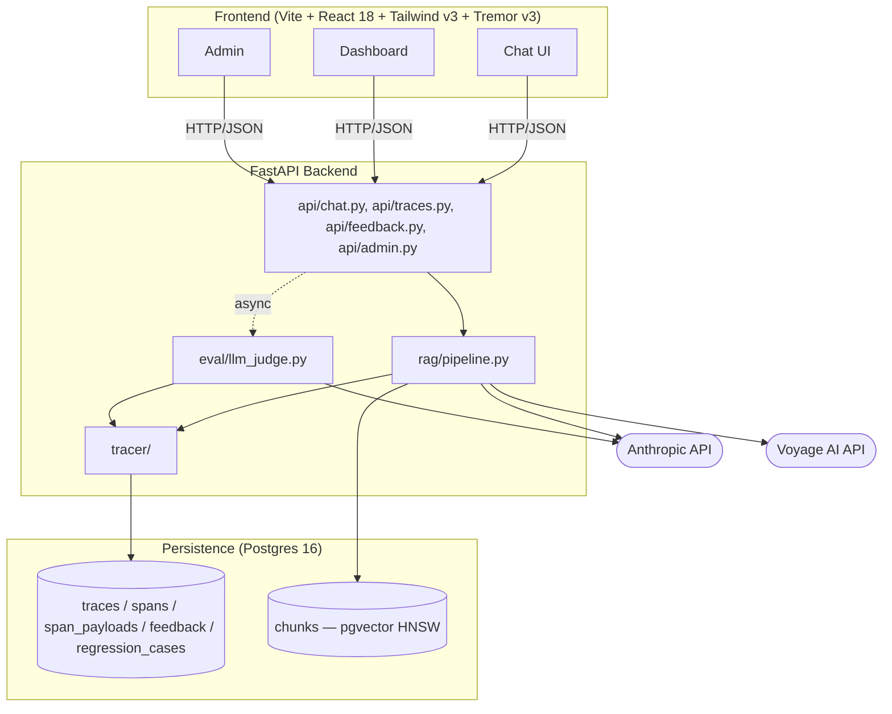

# System Architecture

**Source-of-truth:** [`.planning/research/ARCHITECTURE.md`](../.planning/research/ARCHITECTURE.md) §"System Overview" (the ASCII tree this diagram mirrors) and §"Component Responsibilities" (the table this section condenses).
**Resolves:** DSGN-02 (system architecture diagram).
**Authored:** 2026-05-04. **Renderer:** GitHub-native Mermaid (no custom-renderer directives, no experimental shape syntax — see Pitfall A in `.planning/phases/01-research-design-artifacts/01-RESEARCH.md`).

## Framing

tracer-ai is a three-tier system. A React 18 + Vite SPA (Tailwind v3 + Tremor v3 + shadcn/ui) calls a Python 3.12 FastAPI backend, which queries a single Postgres 16 instance hosting both `pgvector` (chunk embeddings, HNSW cosine index) and the trace database (5 tables, JSONB attributes with GIN indexes). Every RAG pipeline stage emits a span; spans funnel through an `asyncio.Queue` to a background consumer that batch-writes JSONB to Postgres, keeping trace overhead under the 100ms request-path budget. External calls go to Anthropic (Sonnet 4.5 for the bot, Haiku for the judge) and Voyage AI (`voyage-code-3` embeddings). The judge runs in a `BackgroundTasks` async branch — eval failures never break user requests, and the captured OTel context snapshot makes the judge's `rag.eval` span a child of `rag.request` rather than an orphan (Pitfall #1).

## Diagram

**Reading the diagram:**

- Solid arrows are sync, in-process calls (`api --> pipe`) or sync external API calls from the pipeline (`pipe --> anthropic`, `pipe --> voyage`).
- The dotted edge `api -.async.-> eval` is the `BackgroundTasks`-driven async eval branch — it fires *after* the response is flushed to the browser; an eval failure never reaches the user.
- The two cylinder nodes inside `db` are the same physical Postgres 16 instance: `pgvector` chunks share the database with the trace tables (decision: ADR 002 + ADR 004; one Docker service for both).
- Stadium nodes (`anthropic`, `voyage`) are the only off-host hops in the system.

## Component Responsibilities

| Module | Path | Responsibility |
|--------|------|----------------|
| Chat UI | `frontend/src/routes/chat.tsx` | Single-turn or multi-turn chat; renders cited chunks, latency, tokens, cost, thumbs feedback |
| Dashboard | `frontend/src/routes/dashboard*.tsx` | Trace list, trace detail, bad-answer queue, time-series charts |
| Admin UI | `frontend/src/routes/admin.tsx` | Corpus stats, re-index trigger, chunking config, URL ingest |
| `api/` | `tracer_ai/api/` | FastAPI routes; Pydantic request/response schemas; HTTP error envelope |
| `rag/pipeline.py` | `tracer_ai/rag/pipeline.py` | Orchestrates retrieve -> prompt_assemble -> llm_call; emits spans |
| `tracer/` | `tracer_ai/tracer/` | Span dataclass, context propagation, async queue + Postgres writer |
| `eval/` | `tracer_ai/eval/` | LLM-as-judge worker (Haiku); RAGAS-style faithfulness + relevance prompts |
| `corpus/` | `tracer_ai/corpus/` | Markdown-header chunker, Voyage embedder, pgvector retriever |
| `chunks (pgvector)` | Postgres extension | 1024-dim vectors with HNSW cosine_ops index |
| `traces / spans / span_payloads / feedback / regression_cases` | Postgres tables | Trace database (JSONB attrs, GIN-indexed; spans partitioned by `started_at` month) |

## Cross-references

For the request-time data flow (sync `POST /chat` path + async `BackgroundTasks` eval branch + the OTel context-snapshot hand-off that prevents orphaned eval spans), see [`/docs/sequence-diagrams.md`](./sequence-diagrams.md). For module-level imports + acyclicity, see [`/docs/module-deps.md`](./module-deps.md). For the per-span attribute schema (every `gen_ai.*` and `rag.*` attribute, OTel conformance status, example payloads), see [`/docs/trace-schema.md`](./trace-schema.md). Decisions behind the stack live in [`/docs/decisions/`](./decisions/README.md) — particularly ADR 002 (vector store on the same Postgres), ADR 004 (trace store + JSONB partitioning), and ADR 005 (custom tracer with OTel attribute names but no `opentelemetry-sdk` runtime dep).
