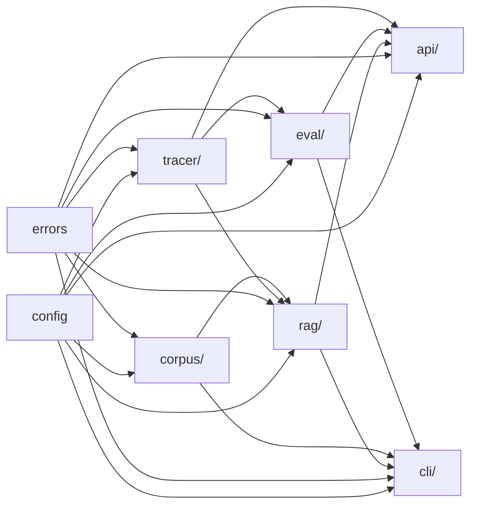

# Module Dependency Graph

**Source-of-truth:** [`.planning/research/ARCHITECTURE.md`](../.planning/research/ARCHITECTURE.md) §"Dependency Graph (no cycles)" (the canonical layer ordering this diagram visualizes) and §"Recommended Project Structure" (the module list).
**Resolves:** DSGN-08 (module dependency diagram with no circular deps).
**Authored:** 2026-05-04. **Renderer:** GitHub-native Mermaid (no custom-renderer directives, no experimental shape syntax — see Pitfall A in `.planning/phases/01-research-design-artifacts/01-RESEARCH.md`).

## Framing

Each module imports only from its declared dependencies. The visual acyclicity check is the Phase 1 gate (DSGN-08) — read the diagram below and confirm there are no cycles. The runtime check (e.g., `import-linter` or a pre-commit AST analyzer) is Phase 2 INFRA-04. The arrow direction reads as "data/dependency flows FROM A TO B" which is also the import direction — `B imports A` means `A --> B`. Module layering matches `.planning/research/ARCHITECTURE.md` §"Dependency Graph (no cycles)".

The graph is intentionally layered left-to-right. Two leaves (`config`, `errors`) sit on the far left; foundation modules (`tracer/`, `corpus/`) come next; the orchestration layer (`rag/`, `eval/`) sits in the middle; entry points (`api/`, `cli/`) are on the far right. Every edge flows strictly left-to-right — that is the visual proof of acyclicity.

## Diagram

**Reading the diagram:**

- An edge `A --> B` means "module B imports from module A" (equivalently: A is a dependency of B).
- `config` and `errors` have **zero incoming edges** — they are leaves; no module depends on something below them, so they cannot participate in a cycle.
- `api` and `cli` have **zero outgoing edges** — they are entry points; nothing imports from them, so they cannot participate in a cycle either.
- Every middle-layer module (`tracer/`, `corpus/`, `rag/`, `eval/`) has its incoming edges strictly to its left and its outgoing edges strictly to its right.

## Module Purpose Table

| Module | Purpose | Imports From | Imported By |
|--------|---------|--------------|-------------|
| `config` | Pydantic Settings; loads env vars; single source of truth for `ANTHROPIC_API_KEY`, `VOYAGE_API_KEY`, `embedding_model`, `chunk_size`, etc. | (none — leaf) | `tracer/`, `corpus/`, `rag/`, `eval/`, `api/`, `cli/` |
| `errors` | Cross-cutting error types and the API error envelope shape | (none — leaf) | `tracer/`, `corpus/`, `rag/`, `eval/`, `api/`, `cli/` |
| `tracer/` | Span dataclass, context propagation, `asyncio.Queue` + Postgres background writer | `config`, `errors` | `rag/`, `eval/`, `api/` |
| `corpus/` | Markdown-header chunker, Voyage embedder Protocol + adapter, pgvector retriever | `config`, `errors` | `rag/`, `cli/` |
| `rag/` | Pipeline orchestrator (retrieve -> prompt_assemble -> llm_call); Anthropic LLM Protocol + adapter | `config`, `errors`, `tracer/`, `corpus/` | `api/`, `cli/` |
| `eval/` | LLM-as-judge worker; RAGAS-style faithfulness + relevance prompts; runs via `BackgroundTasks` | `config`, `errors`, `tracer/` | `api/`, `cli/` |
| `api/` | FastAPI routes + Pydantic schemas; HTTP-layer error envelope | `config`, `errors`, `tracer/`, `rag/`, `eval/` | (none — entry point) |
| `cli/` | Typer-based command surface (`tracer-ai ingest`, `tracer-ai eval`, `tracer-ai promote`) | `config`, `errors`, `rag/`, `corpus/`, `eval/` | (none — entry point) |

## Acyclicity Check

Visual inspection: every edge in the diagram above flows strictly left-to-right. `config` and `errors` have zero incoming edges. `api` and `cli` have zero outgoing edges. No node both imports and is imported by the same other node. Therefore no cycles exist. Phase 2 INFRA-04 will install a pre-commit AST analyzer (e.g., `import-linter`) to runtime-enforce this property; until then, this diagram is the authoritative gate for ROADMAP success criterion 4 ("zero circular dependencies").

## Cross-references

For the system-level view (subgraphs Frontend / FastAPI / Persistence + external services), see [`/docs/architecture.md`](./architecture.md). For the module-level rationale behind each layer, see ADR 005 (observability strategy) and the `.planning/research/ARCHITECTURE.md` §"Structure Rationale".
