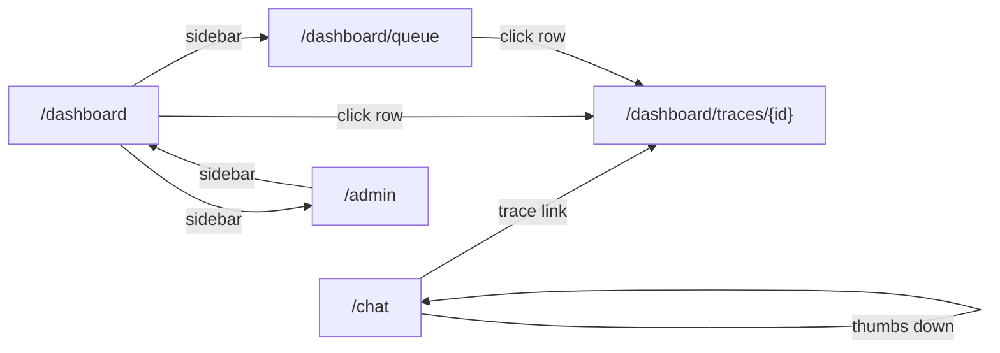

# Wireframes Index

ASCII wireframes for the 5 React routes in tracer-ai. Each file documents the route's component inventory (Tremor v3 + shadcn/ui), the layout, the four standard states (Loading / Empty / Error / Populated), and the interactions that bind UI controls to API endpoints in [api.md](../api.md). No image files, no Figma — diff-able markdown only (D-29).

## Wireframes

| File | Route | Purpose | Bound endpoints |
|------|-------|---------|------------------|
| [chat.md](./chat.md) | `/chat` | Single- and multi-turn chat with cited chunks, latency / token / cost badges, thumbs feedback, and a deep-link to the trace explorer | `POST /chat`, `POST /feedback` |
| [dashboard-list.md](./dashboard-list.md) | `/dashboard` | Trace list with KPI strip + quality drift `AreaChart` + cursor-paginated `Table` | `GET /traces` |
| [dashboard-detail.md](./dashboard-detail.md) | `/dashboard/traces/{id}` | Per-trace waterfall (5 spans), payload inspector, feedback panel | `GET /traces/{trace_id}` |
| [bad-answer-queue.md](./bad-answer-queue.md) | `/dashboard/queue` | Triage queue for user-flagged and judge-flagged bad answers; promote to regression set | `GET /traces?feedback=down`, `GET /traces?min_faithfulness=0.6` |
| [admin.md](./admin.md) | `/admin` | Corpus stats, re-ingest controls, chunking-config form | `GET /admin/corpus`, `POST /admin/ingest`, `PATCH /admin/chunking-config` |

## Click-through Map

The sidebar nav (top-right `[Chat] [Dashboard] [Admin]` in every wireframe's ASCII layout) gives every route reachability to every other route in one click. The arrows above show the **task-driven** click-through paths an operator follows: ask a question → diagnose its trace; triage a queue → diagnose; tune the corpus → return to the dashboard to verify the quality drift chart responded.

## Cross-References

- [API Contract](../api.md)
- [Sequence Diagrams](../sequence-diagrams.md)
- [Trace Schema](../trace-schema.md)
- [Architecture](../architecture.md)
